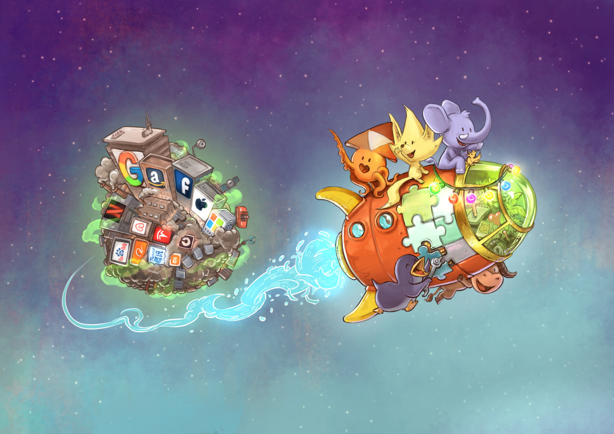
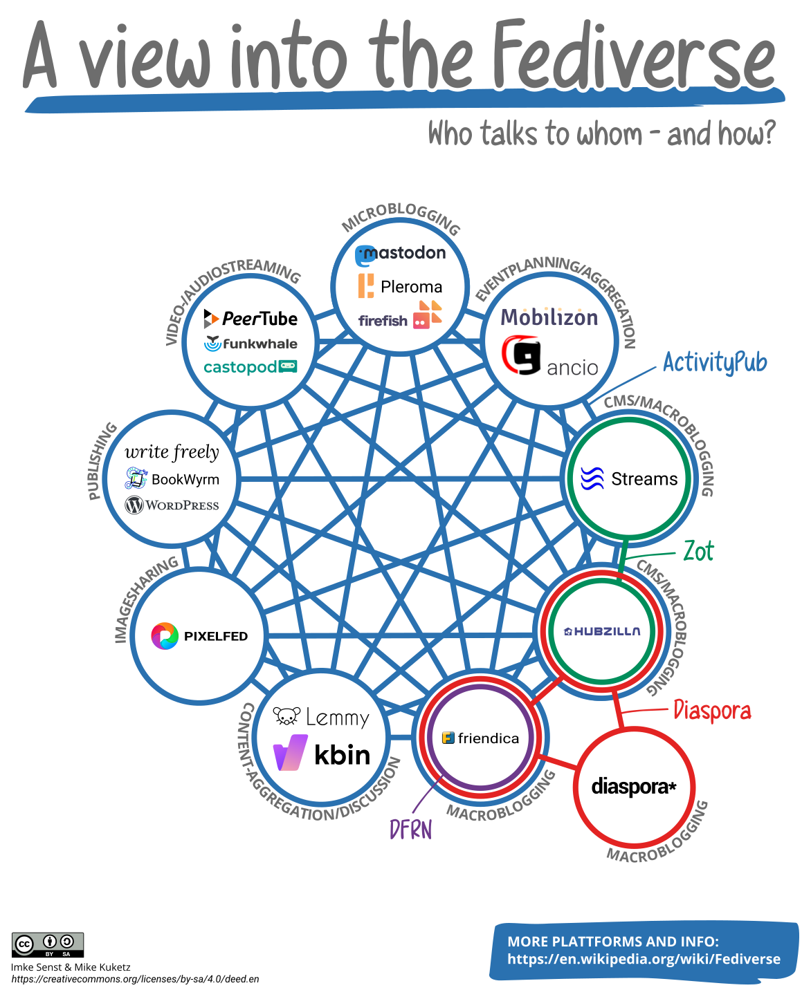

# El Fediverso: la red social alternativa 

<figure>

<figcaption><a href="https://degooglisons-internet.org/public/img/Lets-leave-planet-GAFAM-NATU-BATX_by-David-Revoy.jpg">Degooglisons Internet</a>  by <a href="https://www.davidrevoy.com/">David Revoy</a> está licenciada bajo <a href="https://creativecommons.org/licenses/by/4.0">CC BY 4.0.</a></figcaption>
</figure>

## ¿Qué es esto del Fediverso?

¿Te imaginas que desde tu cuenta de correo electrónico solo pudieses enviar correos a la gente que usa el mismo proveedor que tú (Gmail, Outlook...)? ¿Y que para enviarle un correo a otra persona que no use el mismo servicio que tú tengas que crearte una cuenta de correo electrónico en su servicio? No, ¿verdad?

Sin embargo, en el mundo de las redes sociales, hasta ahora veíamos normal que para interactuar con la gente de X/Twitter tengas que tener una cuenta en X/Twitter, y que para interactuar con las fotos de alguien que use Instagram, tengas que tener una cuenta en Instagram, adicional a la de X/Twitter, y así sucesivamente con Facebook/Meta, YouTube, TikTok, etc. Aunque en este capítulo nos vamos a centrar en las redes sociales, esto no solo sucede en las redes sociales. Por ejemplo, sucede en las aplicaciones de mensajería. Si solo tienes WhatsApp y le quieres enviar un mensaje a alguien que usa Telegram o Signal, tendrás que crearte una cuenta en esos servicios para poderles escribir. Además, para usar WhatsApp, tu única alternativa es usar la aplicación oficial que te dan, no libre.

El Fediverso precisamente busca romper con esta centralización y que gente con cuentas en diferentes servicios pueda interactuar entre ellas. Para empezar, vamos a aclarar algunos términos:

- **Cuenta**: Tu cuenta o identidad tiene una dirección única llamada handle y está alojada en uno de los muchos servidores, también llamados instancias. Por ejemplo, en el caso de ESF, tenemos una cuenta en el Fediverso con la dirección @esfgalicia@mastodon.gal.

- **Instancia**: Una instancia es básicamente una pequeña red social hospedada en un servidor. Cada instancia puede tener su propio conjunto de reglas sobre qué contenido está permitido. También puedes hospedar tu propia instancia. Cada instancia ejecuta un software determinado. Por ejemplo, en nuestro caso la instancia en la que tenemos creada la cuenta es mastodon.gal.

- El software usado en una instancia es esencial para la experiencia de la usuaria y sus posibilidades. Entre los software más usados se encuentran:

  - **Mastodon**: Uno de los más conocidos. Es un software de microblog similar a X/Twitter en cuanto a interfaz y funcionalidades. Microblog significa que tienes un blog con pequeñas (micro) publicaciones que pueden incluir texto, imágenes y vídeo. Normalmente hay un límite de 500 caracteres en las publicaciones de Mastodon.

  - **Peer Tube**: Es un software para compartir vídeos similar a YouTube o Vimeo.

  - **PixelFed**: Es un software de photoblogging similar a Instagram. Tus publicaciones tienen que incluir al menos una imagen y, por supuesto, adicionalmente pueden incluir un texto, hashtags o localización.

  - **Lemmy**: Es un software para la gestión de foros de internet y un agregador de noticias similar a Reddit. Puedes subir enlaces, imágenes o textos y la gente puede votarlas y comentarlas.

  - **Mobilizon**: Es un planificador de eventos. Puedes crear eventos y añadir localización e información, y la gente puede inscribirse.

- **Protocolo**: Es el conjunto de reglas que hacen que se puedan conectar entre sí diferentes instancias y software. El Fediverso emplea el protocolo ActivityPub.

- **Cliente**: Es la aplicación, móvil o de escritorio, que usamos para acceder a nuestra cuenta sin necesidad de usar el navegador (para acceder usando el navegador tendrías que ir a la web de tu instancia, en nuestro caso mastodon.gal, e iniciar sesión allí). A diferencia de las redes sociales tradicionales, donde solo puedes acceder a la red social usando la aplicación oficial que te piden, en el Fediverso existen multitud de aplicaciones (clientes) para acceder a la tuya. La elección de una aplicación u otra depende de los gustos de cada cual: colores, formas de los menús, funcionalidades. Por ejemplo, con el cliente [Fedilab](https://fedilab.app/projects/fedilab/) puedes acceder a tu cuenta creada en una instancia que emplea el software Mastodon, Pleroma, Friendica o Pixelfed.

El Fediverso (universo federado) es la suma de todas las cuentas, en todas las instancias usando cualquier software, comunicándose entre ellas. El Fediverso incluye más que solo proyectos de redes sociales. Cualquier software que se federa mediante uno de los protocolos forma parte del Fediverso. Es decir, desde una cuenta creada en una instancia que emplea el software de Mastodon, puedes seguir una cuenta creada en otra instancia, independientemente de que emplee como software Mastodon, PixelFed o Peer Tube, entre otros. Imagina que por ejemplo en tu muro de X/Twitter también te aparecen fotos que sube la gente a Instagram, o los vídeos que suben a YouTube. La de espacio que ahorraríamos en el móvil...

## Ventajas del Fediverso

Una de las grandes ventajas de usar el Fediverso es la descentralización del poder y la eliminación de los monopolios. Si estás leyendo este capítulo es muy probable que te suene un tal Elon Musk. En 2022 compró Twitter por 44 mil millones (billones americanos) de dólares. Es bien sabida la deriva que tomó la plataforma en cuanto a censura de contenido, fomento del odio y de la violencia, modificación del algoritmo para fomentar cierto tipo de ideologías, etc. Y todo esto controlado por alguien como Elon Musk. ¿Cuál es la ventaja del Fediverso? Que no hay nadie que lo controle en su conjunto ni se puede comprar. Como mucho, alguien podría llegar a comprar una instancia, pero no el Fediverso en su conjunto, ya que el Fediverso en sí es un protocolo libre. Y de ser el caso, las usuarias solo tendrían que migrarse a otra instancia (sin perder sus publicaciones, ni su contenido, ni sus seguidoras...), y listo. Además, si una instancia comienza a publicar contenido de odio o molesto para el resto de las usuarias del Fediverso, el resto de instancias podrían bloquearla. De esta forma, si la instancia en la que estás bloquea a otra instancia, sus publicaciones ya no te aparecerían y, por encima de todo, esa gente ya no podría interactuar contigo. Y si estás en la instancia a la que bloquean o no estás de acuerdo con el tipo de contenido que se sube, siempre te podrías mudar a otra instancia, ateniéndote a las reglas de cada instancia.

De este modo el Fediverso fomenta la tecnodiversidad entendida, de una manera similar a la biodiversidad, como una variedad de perspectivas técnicas o sociopolíticas imprescindible para la construcción de una sociedad más igualitaria y respetuosa de sus miembros que huya de autoritarismos y se vea orientada hacia el bien común.

Tras la compra de Twitter y la deriva autoritaria que tomó, mucha gente se lanzó a la búsqueda de alternativas. Mucha gente descubrió el Fediverso a través de Mastodon (por su similitud con X/Twitter). Sin embargo, mucha otra se decantó por BlueSky, una red centralizada y propiedad de los mismos individuos que vendieron Twitter a Elon Musk en su momento. Como dijeron nuestros compañeros [en un artículo](https://galicia.isf.es/blog/poden-as-redes-sociais-dixitais-realmente-ser-transformadoras/), ”ir a Bluesky desde X es, en el ámbito alimentario, como pasar de Nestlé a El Pozo, pero irse al Fediverso es como el consumo en mercados locales”.

Otra ventaja del Fediverso es la ausencia de un algoritmo de recomendación de contenido, aunque no todo el mundo defiende que no se incluyan este tipo de algoritmos. Por un lado, es cierto que suena atractivo que alguien ordene por ti de forma automática tu muro para que te aparezcan las publicaciones que es más probable que te interesen, en lugar de verlas todas por simple orden cronológico. Sin embargo, ¿quién va a controlar ese algoritmo? Y sobre todo, ¿qué tipo de sesgos va a tener? Como comentamos al inicio de la guía, es bien sabido el impacto que tuvo el escándalo de Cambridge Analytica en el BREXIT o en la primera elección de Donald Trump, manipulando a las usuarias de Facebook para que votasen a favor del BREXIT y de Donald Trump, respectivamente. Si lo que quieres es no perderte entre tantas publicaciones, existen alternativas como la creación de listas temáticas.

## ¿Y cómo entro en el Fediverso?

Pues es muy sencillo. Simplemente tienes que crearte una cuenta. Para ello, debes elegir una instancia en la que crearla. La gente de [imonosxuntas.org](https://imonosxuntas.org/) tiene un apartado con instancias recomendadas. Una vez escojas una, simplemente tendrás que entrar y crear una cuenta como en cualquier otro servicio de internet que usas en tu día a día y listo. Y luego, si quieres poder acceder a tu cuenta desde una aplicación móvil sin usar el navegador, puedes usar uno de los múltiples clientes disponibles, como por ejemplo [Fedilab](https://fedilab.app/projects/fedilab/), [Tusky](https://tusky.app/) u [otras](https://joinmastodon.org/apps).

Cuando vayas a crear una cuenta en una instancia, lo primero que te van a indicar son las normas específicas de esa instancia: lenguas que puedes usar, tipo de contenido prohibido, etc. Además, hay una serie de costumbres que aplican a todo el Fediverso:

- Si subes una imagen, intenta añadir un texto alternativo en el apartado que te aparece indicado. Ojo, esto no es para hacer de pie de foto, para eso ya está el texto que pones en la publicación. El texto alternativo sirve para describirlas y hacerlas accesibles para personas con dificultades de visión, así que intenta que quede bien explicada.

- Añade una advertencia de contenido cuando publicas información sensible o que pueda resultar desagradable o traumática para otras personas. Esto aplica tanto a imágenes como al texto en sí, y hace que la gente pueda decidir expresamente si quiere cargar ese contenido o no. Para hacerlo, tienes que tocar en el triángulo que aparece debajo de la caja donde se escriben los mensajes.

- Existe una opción para eliminar los mensajes cuando pasa cierto tiempo, y también de definir criterios como por ejemplo que no se eliminen aquellas que marcas con una estrella. Esto lo puedes modificar en los ajustes de la cuenta.
