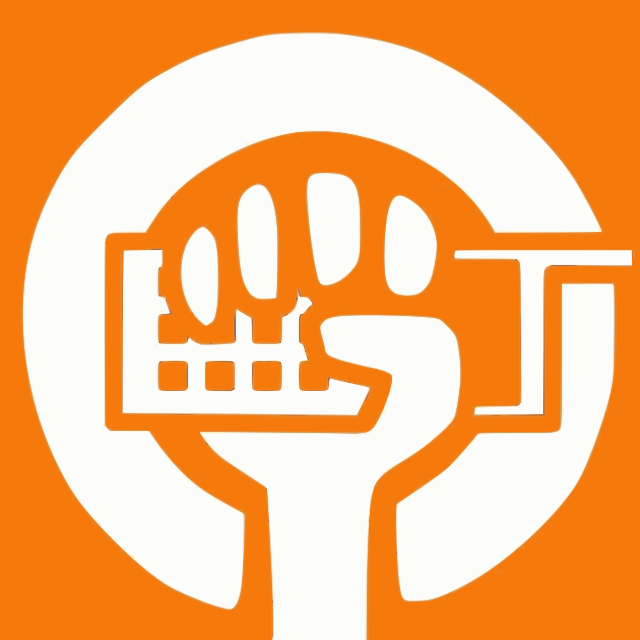

# Guía de Autodefensa Digital

  

**¿Por qué hacemos esta guía?** Vivimos en un mundo que, con su parte buena y su parte mala, se va moviendo hacia el lado digital a pasos agigantados, y en ocasiones dejando a mucha gente atrás. Este mundo digital, al igual que el presencial, también tiene una serie de riesgos de los que protegerse. Muchas de vosotras quizás tenéis a esa persona de confianza (hija, sobrina, amiga...) a quien consultarle dudas o pedir consejo en cosas relacionadas con las tecnologías de la información (TIC), pero no todo el mundo tiene esa opción. Es por eso que hacemos esta guía, explicando de forma clara y detallada cómo puedes mejorar tu seguridad digital, tengas o no conocimientos previos de ciberseguridad.

Antes de comenzar, es importante tener claro que **la seguridad absoluta no existe**, y siempre hay riesgo. Lo que podemos hacer como personas usuarias es poner barreras que nos protejan.

Esta es una guía dinámica.Es decir, la iremos actualizando a medida que nos vayan llegando sugerencias. [En este enlace](https://i.gal/autodefensadigital) podrás consultar siempre la última versión de la guía en formato PDF. Y [en este otro enlace](https://i.gal/repositorio_autodefensadixital) podrás encontrarla en formato editable, por si quieres reutilizarla o [contribuir](https://codeberg.org/ESFGalicia/guia_autodefensa_dixital/src/branch/main/CONTRIBUTING.md) a ella.

Permanece atenta a nuestras redes, ya que a lo largo de los próximos meses iremos realizando charlas y talleres para dar a conocer la guía, explicando los distintos apartados de forma sencilla y ayudándote de forma práctica a implementar los consejos que damos en ella. También nos puedes contactar si quieres organizar algún coloquio en tu zona, asociación o grupo.

---

   
  

    <a href="https://i.gal/autodefensadigital">Guía de autodefensa digital</a> © 2025 por <a href="https://galicia.isf.es">Enxeñería Sen Fronteiras Galicia</a> está bajo la licencia <a href="https://creativecommons.org/licenses/by/4.0/deed.es">CC BY 4.0</a>. 
    Traducida al castellano por la Oficina de Software Libre de la Universidad de Zaragoza <a href="https://osluz.unizar.es">OSLUZ</a>.
  

