# Alternativas libres y encriptadas 

<figure>

<figcaption><a href="https://commons.wikimedia.org/w/index.php?curid=79135607">Peha-Banquet-Degooglisons-CC-By</a> por Peha está licenciada bajo <a href="https://creativecommons.org/licenses/by-sa/4.0/?ref=openverse">CC BY-SA 4.0.</a></figcaption>
</figure>

¿Sabías que es posible vivir sin emplear herramientas que no sean de Google o de Microsoft? Te preguntarás qué tiene de malo usar este tipo de herramientas, tan empleadas hoy en día por el conjunto de la población. En este caso el problema no es tanto de seguridad (que también), sino que más bien se trata de un tema de privacidad. Estas compañías, como muchas otras, ofrecen gran parte de sus servicios completamente gratis. Sin embargo, como se suele decir, si el producto es gratis, en muchas ocasiones el producto eres tú.

Estas compañías recopilan una elevada cantidad de datos de las personas usuarias de su servicio para luego sacarles rentabilidad a través de publicidad, venta a terceras partes, etc. Hay ejemplos claros, como el de [Cambridge Analytica](https://www.elsaltodiario.com/redes-sociales/cambridge-analytica-facebook-injerencias-elecciones-estadounidenses) donde grandes empresas como Meta (la antigua Facebook) empleó los datos de sus miles de usuarias para luego influir en los resultados del BREXIT o de las primeras elecciones de los Estados Unidos de América en las que salió elegido Donald Trump. Por otra parte [Google y Amazon](https://www.elperiodico.com/es/internacional/20231212/proyecto-nimbus-militar-google-amazon-israel-guerra-palestina-gaza-protesta-95733715) colaboraron con el estado genocida de Israel en la identificación de objetivos dándole acceso a sus servicios en la nube. Y como estos muchos ejemplos más. Y te preguntarás, ¿qué alternativas tengo? Pues ahí es donde entran los servicios libres.

Antes de comenzar hay que dejar una cosa clara. Ni todas las aplicaciones gratis son libres, ni todas las aplicaciones libres son gratis. El concepto de libertad está directamente relacionado con el respeto a la privacidad de las personas usuarias. Un software es libre [cuando se puede ejecutar, copiar, distribuir, estudiar, modificar y mejorar](https://www.gnu.org/philosophy/free-sw.es.html#top). Por lo tanto, el simple hecho de que una aplicación sea gratis, no quiere decir que sea libre.

Además, aunque en muchos casos sucede, que una aplicación sea libre no quiere decir que sea gratuita. Hay aplicaciones libres que ofrecen un servicio completamente de pago, o que ofrecen una versión gratuita con limitaciones. Sin embargo, esta versión gratuita tiende a ser más que suficiente para el uso habitual que se le suele dar. Hay que pensar que estas aplicaciones también llegan a tener una serie de costes asociados, como puede ser los servidores a los que nos conectamos de forma gratuita para emplear algún tipo de servicio.

Luego está la importancia de entender bien el concepto de la nube. La nube no es más que un conjunto de ordenadores conectados entre sí. Cuando tú guardas algo en la nube, realmente lo que estás haciendo es guardarlo en un ordenador central (que llamaremos servidor) que está en otro lugar geográfico. Lo mismo sucede cuando envías un mensaje a otra persona. El mensaje no va directo hasta la otra persona, sino que lo que haces es enviarlo a un ordenador central (conocido como servidor), y luego desde ahí se envía a la persona destinataria. En muchas ocasiones, además, una copia del mensaje permanece guardada en el servidor, para que por ejemplo puedas acceder desde otro dispositivo.

Esto es algo que debemos tener en cuenta para comprender la importancia de conceptos como el de que los datos estén encriptados. ¿Y qué es esto de los datos encriptados? Hablamos de servicios encriptados cuando la empresa o entidad que nos ofrece el servicio no tiene acceso de ningún tipo al dato relativo a nuestro uso. En este caso es importante distinguir entre varios tipos de encriptado:

- **Encriptado en tránsito:** los datos están encriptados durante el envío desde nuestro dispositivo hasta el servidor central. Esto permite que aunque alguien intercepte el mensaje o archivo por el camino, no pueda acceder a su contenido.

- **Encriptado en reposo:** los datos son encriptados mientras están en el servidor central. Es decir, la empresa que ofrece el servicio no puede acceder a mis datos almacenados en su servidor. Por ejemplo, un servicio de almacenamiento de imágenes con encriptado en reposo evita que la empresa pueda acceder al contenido de mis fotos almacenadas.

- **Encriptado en el dispositivo:** los datos están encriptados mientras están en nuestro dispositivo. Esto garantiza que otras aplicaciones no puedan acceder a ellos.

Lo importante es emplear servicios que aplican todos esos encriptados de forma simultánea, lo que se conoce como **encriptado de extremo a extremo**, siendo sus siglas en inglés E2EE (End to End Encryption). Esto garantiza que la empresa no tiene ningún tipo de acceso a nuestros datos.

También existe la opción de autoalojar nuestros servicios, es decir, en lugar de depender de servidores externos de correo, calendario, almacenamiento, etc., podemos tener nuestro propio servidor al que acceder remotamente. Relacionado con esto surge el concepto de redes federadas, que consiste en un punto intermedio entre usar un servidor completamente externo y usar tu propio servidor. Esto consiste en comunidades que se ponen de acuerdo para gestionar sus propios servidores, pudiendo estar conectados hasta cierto punto con los servidores de otras comunidades.

Pero claro, te preguntarás: **¿Y qué alternativas tengo?** Pues bien, a continuación vamos a detallar una serie de alternativas libres a algunos de los servicios de Google y Microsoft más empleados hoy en día basándonos en nuestra experiencia, teniendo en cuenta la seguridad y facilidad de uso.

## Grandes conjuntos de herramientas

Antes de comenzar con las distintas alternativas existentes para cada tipo de servicio (correo, navegador, calendario, etc.) vamos a destacar algunos proyectos y conjuntos de herramientas libres que contienen distintas aplicaciones de gran utilidad.

###  [F-Droid](https://f-droid.org/es/)

Consiste en un catálogo de aplicaciones libres para Android, es decir, sería una especie de Google Play Store pero que solo contiene aplicaciones libres. Lo podemos descargar directamente desde su [web](https://f-droid.org/es/). Durante la instalación nos aparecerán una serie de mensajes de seguridad de los cuales no nos tenemos que preocupar. Algunas de las aplicaciones que se recomiendan en esta guía solo pueden ser descargadas desde F-Droid, por lo que se recomienda su instalación.

### 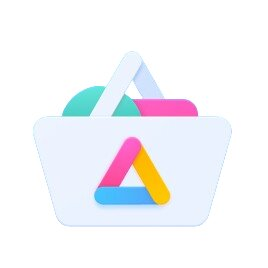 [Aurora Store](https://gitlab.com/AuroraOSS/AuroraStore)

Es probable que en muchas ocasiones no te quede más remedio que instalar alguna aplicación (libre o no), que solo se puede descargar desde la Google Play Store. Aurora Store, disponible en F-Droid, te permite descargar e instalar cualquier aplicación disponible de Google Play Store sin necesidad de disponer de una cuenta de Google, lo que aumenta nuestra privacidad.

###  [Fossify](https://www.fossify.org/)

En todos los dispositivos móviles hay una serie de herramientas imprescindibles independientemente del uso que le vayamos a dar. Estas herramientas son precisamente las que forman el conjunto de Fossify: galería de imágenes, calendario, contactos, notas, gestor de archivos, reproductor de música, SMS, grabadora de voz, cámara, calculadora, alarma, teclado, marcador... Sin duda uno de los proyectos más destacados de herramientas libres para dispositivos móviles, y que no tiene nada que envidiar a las que nos ofrece Google. Fossify surgió como alternativa al conjunto de herramientas Simple Mobile Tools, después de que este último fuese comprado por la empresa israelí ZipApps, la cual introdujo publicidad y opciones de pago.

###  [FramaSoft](https://framasoft.org/gl/)

Otro componente clave en nuestro día a día son las plataformas colaborativas, siendo Framasoft uno de los principales proyectos actuales en este campo. Es una asociación francesa sin ánimo de lucro fundada en 2004 y que busca DesGooglizar internet, ofreciendo un amplio conjunto de herramientas en línea, como un pad colaborativo, una agenda colaborativa, servicio de listas de correo, videollamadas o un gestor de eventos, entre muchas otras. En la sección [DesGooglisons](https://degooglisons-internet.org/gl/) puedes encontrar las distintas alternativas que ofrecen. Hay que tener en cuenta que estas herramientas no tienen encriptado de extremo a extremo.

###  [Proton](https://proton.me)

Nació en Suiza en 2014 cuando un conjunto de personal científico del CERN decidió construir una mejor internet basada en la privacidad. Cuenta con un servicio de correo electrónico, calendario, almacenamiento en la nube, gestor de contraseñas y VPN, todos ellos encriptados para garantizar la privacidad de las personas usuarias.

###  [NextCloud](https://nextcloud.com/)

Nextcloud es un conjunto de programas que permiten la creación de servicios de alojamiento de archivos. Su funcionalidad es similar al software Dropbox o Google Drive, con la diferencia de que Nextcloud es libre. Cuenta con muchas herramientas, como edición de documentos de forma colaborativa, notas, tablero de tareas, videollamadas, etc. Para poder emplearla hay que instalarla en un servidor propio, o contratar a alguien que ofrezca tal servicio.

###  [Disroot](https://disroot.org/)

Disroot es un proyecto radicado en Ámsterdam que ofrece un amplio conjunto de servicios libres. Al igual que sucede en el caso de Framasoft, los datos no están encriptados de extremo a extremo, lo que se debe tener en cuenta a la hora de emplear los servicios. Sin embargo, en algunos casos, esto no tiene por qué ser un problema. [En este enlace](https://disroot.org/es/#services) tienes el conjunto de herramientas que ofrecen.

## Alternativas por tipo de servicio

Una vez presentados cinco de los proyectos más destacados de herramientas libres (hay muchos más), toca pasar a las alternativas específicas para cada servicio.

### Herramientas para ahorrar usando la nube

Cuando empleamos servicios en Internet proporcionados por terceras partes, exponemos nuestra privacidad trasladando información sobre nuestras actividades a las entidades que gestionan el servicio, a las que gestionan los recursos informáticos empleados y a las operadoras de las redes de telecomunicación por las que viaja la información.

Además, en muchos casos puede suponer un gasto innecesario de recursos: si enviamos una foto a una persona que está sentada a nuestro lado empleando el servicio de mensajería de moda, haremos que la foto viaje a servidores de EE. UU. para regresar nuevamente deshaciendo el camino hasta llegar al teléfono de la persona destinataria.

Existen herramientas libres que nos permiten compartir contenidos con otras personas, o mantener sincronizadas carpetas en diferentes dispositivos minimizando la exposición de nuestra privacidad y el consumo de recursos necesarios en la red Internet.

#####  [LocalSend](https://localsend.org/)

Es una aplicación que puedes emplear en tus ordenadores y teléfonos para enviar puntualmente todo tipo de contenidos de un dispositivo a otro. Solo funciona entre dispositivos que estén conectados en la misma red y tengan instalada la aplicación. Los datos enviados viajarán de uno a otro dispositivo sin pasar por Internet, reduciendo los riesgos de privacidad y los recursos consumidos, y evitando que la saturación en los recursos de Internet afecte a la velocidad del envío.

Es una buena opción para enviar archivos puntualmente entre tus dispositivos o a los dispositivos de las personas con las que sueles compartir espacio (misma red WiFi).

##### 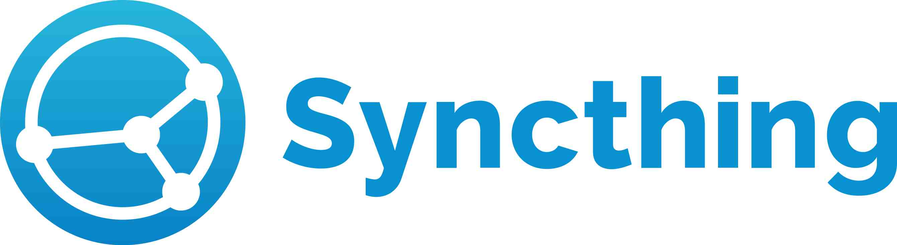 [Syncthing](https://syncthing.net/)

Permite mantener sincronizado el contenido de carpetas en diferentes dispositivos, ya sean ordenadores o teléfonos móviles. Los dispositivos pueden estar en la misma red o en diferentes lugares del planeta. Syncthing busca el camino a través de Internet para conectarlos y sincronizar los contenidos. Los requisitos son que los dispositivos a sincronizar estén encendidos simultáneamente el tiempo necesario para sincronizar los datos. Si los datos se sincronizan en más de dos dispositivos, Syncthing irá sincronizando la información puntualmente en los dispositivos que permanezcan encendidos en cada momento.

Syncthing emplea una tecnología similar a la red Torrent, con lo que consigue sincronizar solo las partes de la información que cambian en cada momento sin necesidad de enviar nuevamente el archivo entero. Además, tarda el mismo tiempo en sincronizar dos ordenadores o veinte, lo que lo hace muy interesante para compartir carpetas con contenidos cambiantes entre grupos o equipos de personas.

Puede ser una buena opción para compartir carpetas entre grupos de personas de manera eficiente y privada o para mantener sincronizados contenidos entre tus propios dispositivos.

#####  [FreeFileSync](https://freefilesync.org/)

Herramienta multiplataforma (GNU/Linux, Android, Windows y Mac) para la gestión de copias de seguridad. Simplemente le tienes que indicar de qué carpeta quieres hacer una copia de seguridad y dónde quieres hacerla, y automáticamente hace la copia de seguridad de los archivos nuevos. [En esta sección](https://freefilesync.org/manual.php?topic=synchronization-settings) de su web explican los diferentes modos que tiene la aplicación para realizar las copias de seguridad. Y en su web también tienen una serie de tutoriales explicando el funcionamiento de la herramienta.

### Correo electrónico

#####  [Proton Mail](https://proton.me/mail)

Es el servicio de correo perteneciente al conjunto de Proton. Está cifrado de extremo a extremo para garantizar la privacidad de los datos, y el plan gratis consta de 1 GB para almacenamiento. Esto es más que suficiente, especialmente si se mantiene limpia la bandeja de entrada. En caso de ser necesario consta de varios planes de pago para aumentar el espacio disponible.

#####  [Tuta Mail](https://tuta.com/secure-email)

Tuta es otra de las grandes alternativas de correo electrónico cifrado de extremo a extremo. El plan gratis ofrece 1 GB de almacenamiento. Además, el plan gratis solo permite crear una cuenta de correo por persona.

#####  [Thunderbird](https://www.thunderbird.net/gl/)

Cuando hablamos de correo electrónico es necesario diferenciar entre servicio de correo y cliente (la aplicación donde lo consultamos). En el caso de Proton, nos ofrece tanto el servicio de correo como el cliente para este servicio, como en el caso de Gmail. Sin embargo, en ocasiones tenemos otros correos que queremos llevar en nuestro dispositivo móvil, como puede ser el correo de la universidad o el del trabajo. Es aquí donde aparece Thunderbird, un cliente de correo libre para consultar los correos en nuestro móvil o en el ordenador. Cabe destacar que está desarrollado por la Fundación Mozilla, más conocida por su navegador web: Firefox.

##### 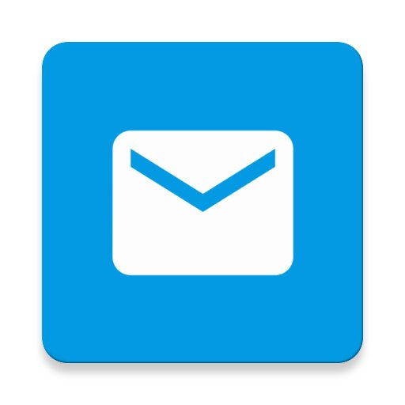 [Fair Email](https://email.faircode.eu/)

Solo disponible para Android. Es un cliente de correo electrónico, no ofrece servicio de correo.

### Calendario

##### 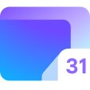 [Proton Calendar](https://proton.me/calendar)

Como os podréis imaginar, también pertenece al conjunto de Proton, y también está encriptado. Tiene todas las funciones que se suelen necesitar de un calendario: accesible en línea, creación de eventos colaborativos (incluso con personas que no usen Proton), recordatorios, etc.

#####  [Tuta Calendar](https://tuta.com/es/calendar)

Al igual que en el caso del correo, Tuta es otra de las alternativas de correo en la nube encriptado.

#####  [Calendario de Fossify](https://github.com/FossifyOrg/Calendar)

Al igual que en el caso del correo electrónico, cuando hablamos de calendario hay que diferenciar entre servicio y cliente. Proton Calendar nos ofrece un servicio de calendario y un cliente para este servicio, pero puede darse el caso de que tengamos otros calendarios online asociados por ejemplo a la cuenta del trabajo. Y es aquí donde entra el Calendario del conjunto de Fossify permitiéndonos ver y editar esos otros calendarios.

#####  [Calendario de Nextcloud](https://apps.nextcloud.com/apps/calendar)

Herramienta del entorno Nextcloud que permite crear calendarios colaborativos. Ideal para cuando necesitas compartir un calendario públicamente. Para emplearlo puedes instalar NextCloud en un servidor o emplear una de las múltiples instancias en abierto, como [framagenda.org](https://framagenda.org/apps/calendar/) o [la de Disroot.org](https://cloud.disroot.org).

#####  [Framadate](https://framadate.org/abc/gl/)

Framadate no es un calendario como tal, sino una herramienta para decidir la fecha para un determinado evento.

### Mensajería instantánea

#####  [Matrix](https://matrix.org/)

Otro de los servicios imprescindibles es el de la mensajería instantánea. Matrix es un protocolo de comunicación seguro, descentralizado y encriptado para mensajería. Para ser empleado es necesario instalar alguno de los clientes (una aplicación) que indican en su [página](https://matrix.org/ecosystem/clients/). [Element](https://element.io/) es uno de los clientes más conocidos y empleados. Es multiplataforma, pudiendo ser empleado tanto desde el ordenador como desde un dispositivo móvil. Un detalle a tener en cuenta es el hecho de que no se requiere un número de teléfono móvil para registrarse. Una de las ventajas del servicio de Matrix sobre el siguiente, Signal, es que Matrix permite la descentralización del servicio. ¿Y qué es esto de la descentralización? De eso hablamos en detalle en el capítulo [El Fediverso: la red social alternativa](fediverso.md#cap:fediverso).

#####  [Signal](https://signal.org/)

Es un servicio de mensajería instantánea para móviles que destaca por el protocolo de encriptado propio, disponible en abierto. Permite crear tanto grupos como conversaciones privados. Para registrarse es necesario introducir un número de teléfono móvil.

¿Por qué no incluimos **Telegram**? Consideramos que Telegram no se puede considerar una herramienta de comunicación segura, ya que no es encriptada de extremo a extremo. Sí que es cierto que tiene la opción de conversación segura entre dos personas que sí que es encriptada de extremo a extremo, pero por defecto las conversaciones entre dos personas no son en este modo seguro. Además, las conversaciones de grupos no tienen opción de ser encriptadas de extremo a extremo.

### Videollamadas

##### 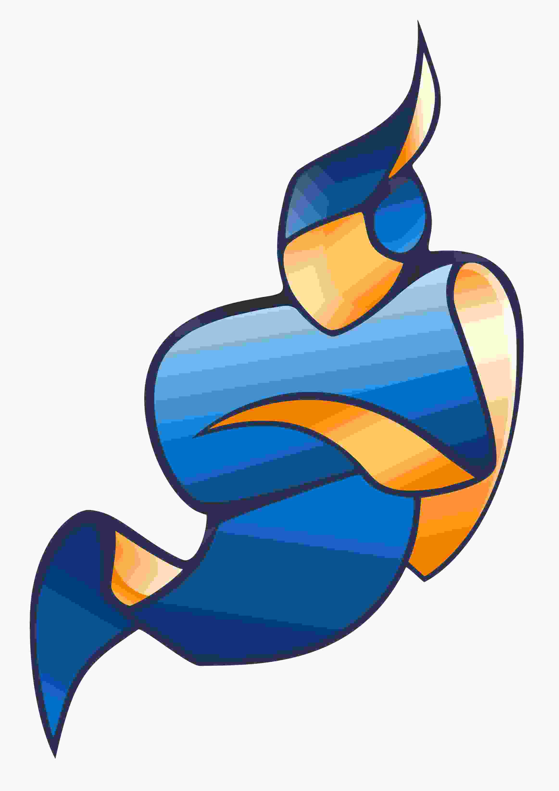 [Jitsi](https://jitsi.org/)

Algo que se volvió muy habitual en nuestro día a día son las videollamadas, y parece que vino para quedarse. Jitsi permite la conexión por vídeo y audio, la grabación de las sesiones, chat interno y muchas otras funciones. Se puede autoalojar en un servidor propio o usar uno de los múltiples servidores que hay en abierto, como [el gestionado por el propio equipo de Jitsi](https://meet.jit.si/). No es necesario instalar nada para emplearlo. La gente de Disroot también ofrece [un servidor](https://calls.disroot.org/).

#####  [BigBlueButton](https://bigbluebutton.org/)

Probablemente el servicio de videollamadas libre más potente. Está especialmente pensado para el sector educativo, aunque es empleado también en el resto de campos. Permite también la comunicación por vídeo y audio, además de una ventana en la que ir mostrando una presentación en PDF sin necesidad de compartir pantalla, especialmente útil en situaciones con baja velocidad de internet. También cuenta con una opción para grabar las sesiones. Para usarla es necesario instalarla en un servidor o bien buscar algún servidor abierto.

#####  [VDO.Ninja](https://vdo.ninja/)

Aunque la herramienta está más pensada para compartir nuestra cámara web con otro dispositivo, también permite emplearla para hacer videollamadas. Tiene la ventaja de que el vídeo se transmite punto a punto, sin sobrecargar el servidor (que solo sirve para poner en contacto a las partes). Cuando creamos una sala nos permite editar una serie de parámetros como si le pedimos a la gente que ponga un nombre que se muestre en la pantalla. Para emplearla podemos usar [la propia instancia oficial](https://vdo.ninja/) o alguna que haya en abierto.

### Ofimática

#####  [LibreOffice](https://gl.libreoffice.org/home/)

La suite de ofimática libre más conocida y potente. Contiene todo tipo de herramientas: editor de texto, hoja de cálculo, presentaciones, etc. A algunas de vosotras os sonará también OpenOffice, pero este es un proyecto abandonado, y [se recomienda cambiar a LibreOffice](https://www.libreoffice.org/discover/libreoffice-vs-openoffice/). Además, si es vuestra primera vez con LibreOffice, o si queréis profundizar un poco más, tienen [un conjunto de guías muy útiles](https://documentation.libreoffice.org/es/documentacion-en-espanol/iniciacion/).

#####  [OnlyOffice](https://www.onlyoffice.com/es/download-desktop.aspx)

Otra suite de ofimática libre, menos conocida y potente. Contiene también todo tipo de herramientas: editor de texto, hoja de cálculo, presentaciones, etc. La interfaz gráfica es más similar a la de Microsoft Office. Una de las principales desventajas es que no emplea [formatos libres de archivos](https://es.libreoffice.org/descubre/opendocument/), sino que emplea los formatos de Microsoft.

#####  [PDF Arranger](https://github.com/pdfarranger/pdfarranger)

Herramienta de escritorio para unir varios PDF. También permite convertir imágenes a PDF.

### Ofimática colaborativa

#####  [Etherpad](https://etherpad.org/)

Editor en línea colaborativo, permitiendo a múltiples personas editar a la vez un documento. Para emplearla, o bien se instala en un servidor desde cero, o bien se emplea alguna de las múltiples instancias que hay disponibles, como la de [Framapad](https://framapad.org/abc/gl/) o [el pad de Disroot](https://pad.disroot.org/). En este caso los pads no están encriptados.

#####  [Cryptpad](https://cryptpad.org/)

Otra de las herramientas para editar de forma colaborativa, en la que en este caso los pads están encriptados de extremo a extremo. También permite crear hojas de cálculo, tableros kanban, etc. Para emplearla sin instalarla en un servidor, puedes emplear una de las [múltiples instancias](https://cryptpad.org/instances/) en abierto, como [la oficial del equipo de Cryptpad](https://cryptpad.fr/) o [el Cryptpad de Disroot](https://cryptpad.disroot.org/).

#####  [Framacalc](https://framacalc.org/abc/gl/)

Herramienta de hojas de cálculo colaborativo ofrecida por la gente de [Framasoft](https://framasoft.org/gl/). Las hojas de cálculo se eliminan después de 335 días de inactividad (sin acceso y/o sin modificación), para evitar el crecimiento de la base de datos indefinidamente. Además, solo pueden contener un máximo de 100.000 filas y no es posible crear hojas de cálculo de varias hojas ni importar archivos OpenDocument o Microsoft Office. Y por [motivos de seguridad](https://contact.framasoft.org/fr/faq/#calc-remove), no se pueden eliminar hojas de cálculo a simple solicitud.

### Formularios

#####  [Liberaforms](https://www.liberaforms.org)

Herramienta para crear formularios en línea. Permite exportar las respuestas a una hoja de cálculo, activar las notificaciones de correo, etc. Para emplearla, se puede instalar en un servidor o emplear una de las instancias en abierto, como las que ofrece el propio equipo de Liberaforms (gratis, pero limitadas a 250 respuestas por año): [usem.liberaforms.org](https://usem.liberaforms.org), [my.liberaforms.org](https://my.liberaforms.org/) o [erabili.liberaforms.org](https://erabili.liberaforms.org/). También tienen [planes de pago](https://www.liberaforms.org/es/servicios) que permiten un mayor número de respuestas. Tanto en el plan gratis como de pago, se puede configurar que las respuestas se almacenen de forma encriptada. La gente de Framasoft también ofrece [una instancia](https://beta.framaforms.org/) (en fase beta) basada en Liberaforms.

#####  [Yakforms](https://yakforms.org/)

Yakforms es otra de las herramientas para crear formularios en línea. Para emplearla puedes instalarla en un servidor o utilizar unas de las [múltiples instancias en abierto](https://yakforms.org/en/pages/explore.html), como la de [Framaforms.org](https://framaforms.org/) (del equipo de [Framasoft](https://framasoft.org/)). Framaforms tiene un límite de 200 formularios por cada cuenta y de 5000 respuestas por formulario. Además, cada uno de ellos dura 6 meses.

### Notas

#####  [Standard Notes](https://standardnotes.com/)

Una de las alternativas más conocidas. Se puede trabajar de forma local, o crear una cuenta gratis y guardar las notas encriptadas de extremo a extremo en su servidor, de forma que podamos acceder a ellas desde otros dispositivos. Tiene un plan de pagos que incluye una serie de funciones extras.

#####  [NotesNook](https://notesnook.com/)

Aunque quizás menos conocida que la anterior, es una alternativa muy potente. Las notas también están encriptadas de extremo a extremo, y el plan gratis incluye alguna función más que en el caso anterior. Como siempre, es cuestión de probar y ver cuál cumple nuestros requisitos.

#####  [Joplin](https://joplinapp.org/)

Esta es otra de las opciones más destacadas. A diferencia de las anteriores, no permite la sincronización en la nube gratis, para lo que habría que suscribirse o bien autoalojarla en un servidor.

### Mapas

##### 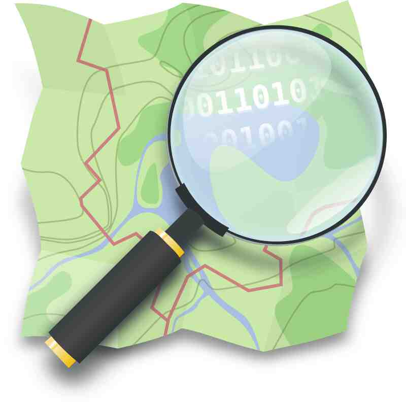 [OpenStreetMap](https://www.openstreetmap.org/)

Es una iniciativa para crear y proporcionar información geográfica de forma libre, y no solo mapas de las calles. Para ser empleados desde el móvil es más fácil si empleamos una de las múltiples aplicaciones que lo usa como fuente de información geográfica.

##### 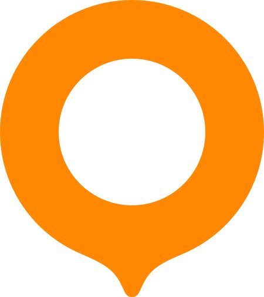 [OsmAnd](https://osmand.net/)

Probablemente la aplicación más potente para emplear OpenStreetMap en nuestro dispositivo móvil. Dispone de un montón de herramientas, como descargar los mapas para consultarlos sin internet, navegador para el coche, seguimiento de rutas, editor del propio OpenStreetMap y muchas más.

#####  [CoMaps](https://www.comaps.app/)

Aunque con menos opciones que OsmAnd, es otra alternativa muy recomendable para emplear OpenStreetMap en nuestro móvil de forma más sencilla. Es un fork de OrganicMaps gestionado por la comunidad, [y que surgió por problemas de gobernanza.](https://news.itsfoss.com/organic-maps-fork-comaps/)

#####  [uMap](https://umap-project.org/)

En ocasiones puede que necesitemos compartir un mapa con puntos señalados o formas dibujadas. Aquí es donde entran herramientas como uMap. Para emplearla, se puede instalar en un servidor o emplear instancias como [umap.openstreetmap.fr](https://umap.openstreetmap.fr/) o [framacarte.org](https://framacarte.org).

### Navegador web

##### 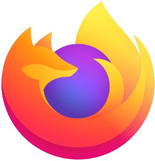 [Firefox](https://www.mozilla.org/gl/firefox/)

Es uno de los navegadores más potentes y conocidos, y es libre, siendo gestionado por la Fundación Mozilla. A diferencia de otras opciones no libres, destaca por un menor consumo de recursos, además del respeto de la privacidad de las personas usuarias.

##### 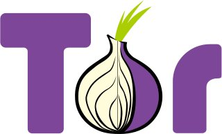 [TOR](https://www.torproject.org/
)

Si quieres ir un paso más allá, la red Tor proporciona un paso extra de privacidad desviando tu conexión por múltiples puntos, lo que dificulta más el seguimiento de tus búsquedas. En el capítulo [VPN, proxies y red Tor. Qué diferencias hay y cuándo utilizarlas.](vpn_proxy_tor.md#cap:VPN_proxy_TOR) explicamos con más detalle el funcionamiento de la red TOR.

### Buscador web

#####  [Startpage](https://www.startpage.com/)

Una de las más conocidas y empleadas. Su sede está en los Países Bajos, estando sometida a la normativa europea de protección de datos. Los resultados obtenidos se basan principalmente en el buscador de Google. Sí, esto puede sonar raro teniendo en cuenta que estamos hablando de herramientas alternativas a Google. Sin embargo, Startpage asegura no almacenar información personal como la dirección IP o historial de búsqueda.

##### 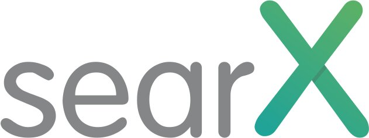 [SearX](https://github.com/searx/searx?tab=readme-ov-file)

Otra opción es la de Searx, un metabuscador descentralizado. A diferencia de los anteriores, no consiste en un buscador en sí, sino que recoge las búsquedas obtenidas por múltiples buscadores como DuckDuckGo, Google, Bing, Startpage... Esto hace más complejo hacer un seguimiento de la persona usuaria. Como punto negativo está que en ocasiones alguno de los buscadores que emplean lo bloquea temporalmente. Para probarlo puedes probar una de las [múltiples instancias disponibles](https://searx.space/).

### Almacenamiento en la nube

#####  [Proton Drive](https://proton.me/drive)

Otro de los servicios del conjunto Proton es Proton Drive, que permite almacenar archivos en la nube de forma segura, estando estos encriptados de extremo a extremo. En el plan gratuito contamos con 5 GB, ampliable a través de planes de pago. Su sede y los servidores se encuentran en Suiza. Su seguridad está auditada externamente, lo que quiere decir que una empresa o entidad externa a Proton ha analizado la seguridad de sus servidores.

#####  [Filen.io](https://filen.io/)

El plan gratuito ofrece 10 GB de almacenamiento encriptado de extremo a extremo. Los servidores y su sede están en Alemania. Es multiplataforma, teniendo versión del cliente para GNU/Linux, Android, iOS, Mac y Windows, además de cliente web. No está auditada externamente.

#####  [Internxt Drive](https://internxt.com/es/drive)

Internxt es una plataforma de almacenamiento en la nube centrada en la privacidad, con cifrado de extremo a extremo. El plan gratuito ofrece 1 GB de almacenamiento para siempre, con planes de pago disponibles de hasta 10 TB. La seguridad está auditada externamente. Los archivos cifrados se almacenan en la UE: Francia, Alemania y Polonia. La empresa tiene su sede en España.

#####  [Internxt Send](https://send.internxt.com)

A veces solo necesitamos la nube para enviarle a alguien de forma remota un archivo de gran tamaño. Para estos casos, la gente de Internxt tiene este servicio que, en el plan gratuito, nos permite enviar archivos de hasta 5 GB, que están disponibles para descarga durante 15 días, siendo eliminados pasado ese tiempo. Hay que tener en cuenta que en este caso cualquier persona con el enlace podría ver los archivos, por lo que si es información privada se recomienda emplear los otros servicios comentados en esta sección, o protegerlos de forma local con contraseña.

#####  [OnionShare](https://onionshare.org)

OnionShare es una herramienta que te permite compartir archivos de forma segura a través de la red TOR, entre otras funciones. En este caso, tanto la persona que envía el archivo como la que lo recibe deben instalar la aplicación.

##### 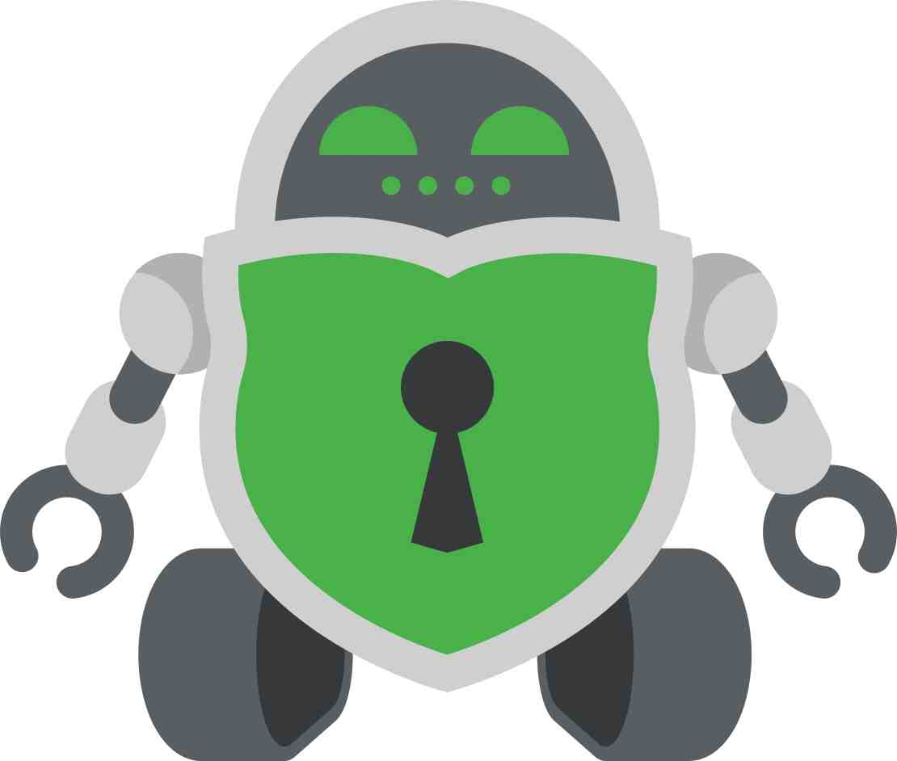 [Cryptomator](https://cryptomator.org)

Cryptomator es una alternativa intermedia. No ofrece un espacio de almacenamiento como tal, sino que permite emplear servicios de almacenamiento en la nube no privados como Google Drive encriptando los datos de forma sencilla antes de subirlos. Es multiplataforma y gratuito, salvo la versión de Android disponible en las tiendas de aplicaciones, que requiere un pago único para poder usarla.

### Gestor de contraseñas

#####  [Bitwarden](https://bitwarden.com/)

Es uno de los gestores de contraseñas más conocidos y seguros. Es multiplataforma, pudiendo emplearlo tanto en el ordenador como en dispositivos móviles, consta de función de almacenamiento de contraseñas (las cuales se almacenan de forma encriptada), de generación automática de contraseñas seguras, y de envío de texto de forma encriptada. Muchas veces tendemos a emplear contraseñas sencillas, repitiéndolas en múltiples sitios web, lo que disminuye nuestra seguridad en la red. El uso de gestores como Bitwarden mejora nuestra seguridad, como explicamos en detalle en el capítulo [Contraseñas seguras y autenticación en dos pasos](contrasinais.md#contrasinais-2fa).

#####  [Proton Pass](https://proton.me/pass)

Herramienta perteneciente al conjunto de herramientas de Proton. Tiene funciones similares a las de Bitwarden.

### Autenticación en dos pasos (2FA)

##### 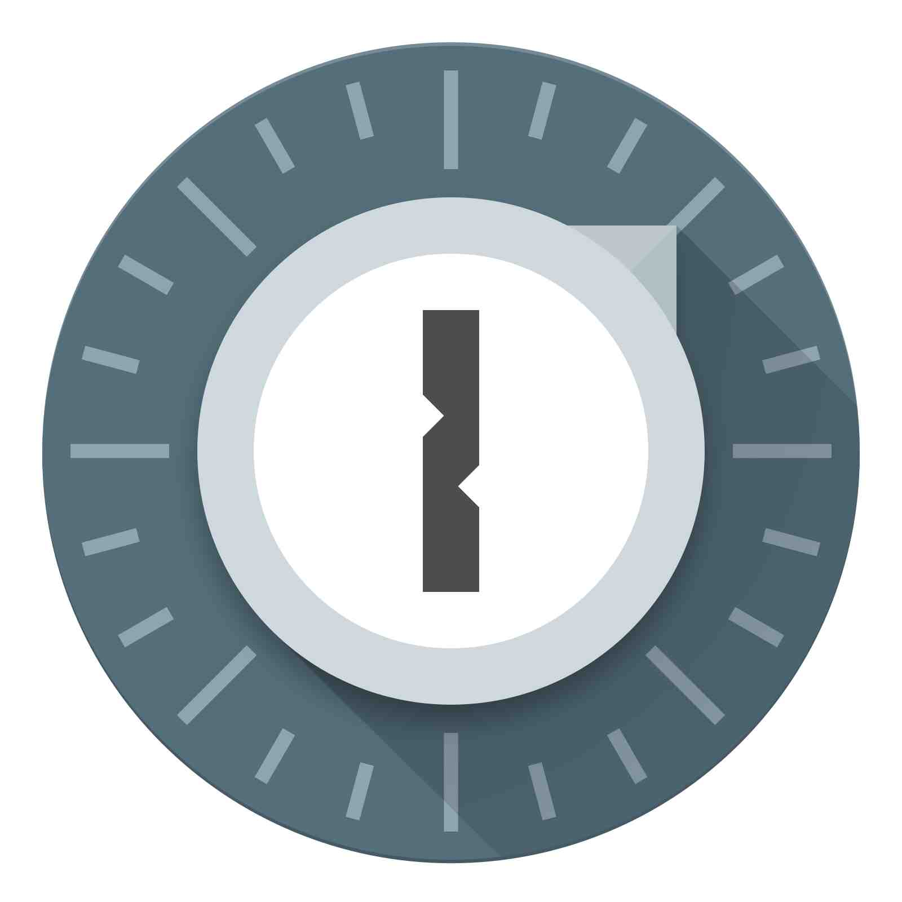 [FreeOTP](https://freeotp.github.io/)

La autenticación en dos pasos está muy relacionada con el uso de los gestores de contraseñas. No hay contraseñas 100% seguras, por lo que es interesante aumentar las capas de protección, y aquí es donde entra la autenticación en dos pasos. Esto no es más que un código de seis dígitos que tenemos que introducir para iniciar sesión tras introducir correctamente nuestra contraseña. Este es un código temporal que va cambiando, y aquí es donde resulta útil el uso de herramientas como FreeOTP, que nos permiten almacenar estos códigos de forma sencilla.

### Organización del hogar

#####  [KitchenOwl](https://kitchenowl.org/)

Aplicación multiplataforma con una serie de funcionalidades útiles para personas que comparten hogar, como la lista de la compra o el registrador de gastos compartidos.

### Reproducción multimedia

#####  [NewPipe](https://newpipe.net/)

NewPipe es un cliente móvil para ver vídeos de YouTube desde tu móvil sin necesitar los servicios de Google y librándote de toda la telemetría. Además, a diferencia de otras alternativas, tiene la ventaja de que no funciona con la API de YouTube, [sino que hace web scrapping de la web](https://newpipe.net/FAQ/#download-youtube-api), lo que te permite obtener un anonimato real. También permite ver los comentarios, seguir canales y descargar vídeos y/o audios.

##### 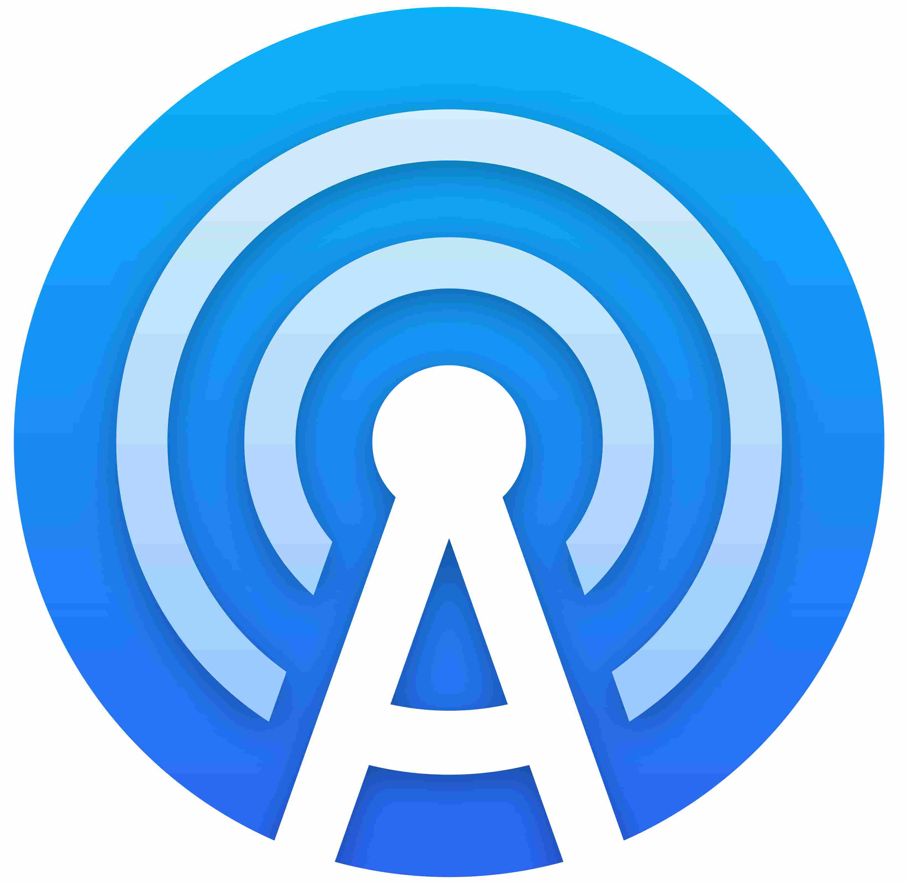 [AntennaPod](https://antennapod.org/)

AntennaPod es un cliente móvil para escuchar podcasts. Tiene opciones para buscar directamente podcasts dentro de la aplicación, descargar episodios y recibir avisos cuando se publique un nuevo podcast, entre otras.

#####  [VLC](https://www.videolan.org/vlc/)

Reproductor de todo tipo de formatos de vídeo y audio.

### Edición multimedia

#####  [GIMP (GNU Image Manipulation Program)](https://www.gimp.org/)

GIMP (acrónimo de GNU Image Manipulation Program) es un programa de escritorio para la edición de imágenes en formato mapa de bits, como por ejemplo fotografías. Contiene todo tipo de herramientas. [Hay disponible un amplio conjunto de tutoriales](https://docs.gimp.org/es/).

#####  [InkScape](https://inkscape.org/es/)

Inkscape es una herramienta de escritorio de dibujo multiplataforma de código abierto para gráficos vectoriales SVG. Las características de SVG soportadas incluyen formas básicas, caminos, texto, canal alfa, transformaciones, gradientes, edición de nodos, exportación de SVG a jpg, agrupación de elementos, etc. [Hay disponible un conjunto de tutoriales.](https://inkscape.org/es/aprende/tutorials/)

##### 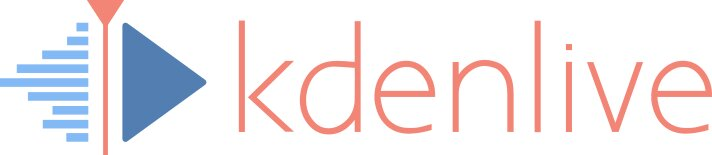 [KDEnlive](https://kdenlive.org)

KDEnlive es un software de escritorio de edición de vídeo. Ofrece una amplia variedad de herramientas para cortar, mezclar y aplicar efectos a los vídeos, además de soportar varios formatos de archivos. [Hay disponible un conjunto de tutoriales.](https://docs.kdenlive.org/es/getting_started/tutorials.html)

### Escaneo de documentos

#####  [OSS Document Scanner](https://github.com/Akylas/OSS-DocumentScanner)

Herramienta útil para escanear documentos con el móvil y exportarlos a PDF. También permite convertir a PDF imágenes que tenemos en el propio móvil, recortarlas, aplicar filtros para destacar el texto y muchas más.

### ¿Necesitas una alternativa para otro servicio?

#####  [PrivacyTools.io](https://www.privacytools.io/)

Amplio catálogo de herramientas que respetan la privacidad de las personas usuarias para distintos tipos de servicio. Nosotros en la guía incluimos aquellas con las que teníamos experiencia y que nos parecieron especialmente útiles, pero en su página podréis encontrar muchas más.

#####  [AlternativeTo.net](https://alternativeto.net/)

Página útil donde se puede introducir el nombre de la aplicación y encontrar distintas alternativas. Hay que tener en cuenta que no todas las alternativas que muestra son libres. Para ver solo las libres, hay que marcar la etiqueta Open Source.

#####  [Desgooglicemos Internet](https://degooglisons-internet.org/gl/)

Sección de Framasoft que contiene alternativas libres a servicios de Google.

#####  [CHATONS](https://www.chatons.org)

CHATONS es el Colectivo de Hosters Alternativo, Transparente, Abierto, Neutral y Solidario (CHATONS son las siglas en inglés). Este colectivo busca dar a conocer estructuras que ofrecen servicios en línea gratuitos, éticos y descentralizados para que sea más fácil encontrar alternativas a servicios ofrecidos por la GAFAM (Google, Apple, Facebook, Amazon, Microsoft) que respeten su privacidad. CHATONS fue iniciado por el colectivo Framasoft en 2016 tras la campaña Desgooglicemos Internet. Tienen [esta otra página](https://entraide.chatons.org) con alternativas a los principales servicios. Se debe ser consciente del uso que le damos a las herramientas que aparecen, ya que en muchos casos la información no está encriptada de extremo a extremo.
