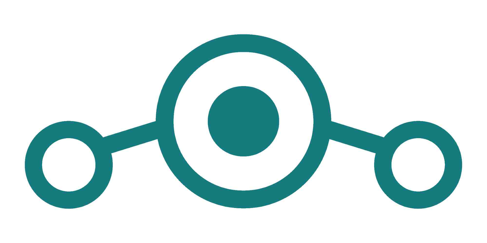

# Los Sistemas Operativos. Alternativas libres y seguras.

En este capítulo os hablaremos del sistema operativo, explicando qué es y la importancia de usar alternativas libres.

## ¿Qué es un sistema operativo?

Un **sistema operativo** es el software fundamental que gestiona y controla el hardware de un ordenador, móvil u otro dispositivo electrónico. Actúa como un puente entre la usuaria y el hardware, permitiendo que se ejecuten aplicaciones y garantizando que los recursos del sistema (procesador, memoria, almacenamiento, dispositivos de entrada/salida, etc.) se utilicen de forma eficiente.

### Funciones principales de un sistema operativo

- **Gestión de procesos**: controla la ejecución de los programas, asignando tiempo de procesador y garantizando que funcionen correctamente sin interferencias.

- **Gestión de la memoria**: distribuye la memoria disponible entre los diferentes programas en ejecución.

- **Gestión de almacenamiento**: organiza y controla el acceso a los archivos y directorios en el disco duro u otros medios de almacenamiento.

- **Gestión de dispositivos**: permite que el hardware, como impresoras, teclados o cámaras, funcione correctamente y sea reconocido por el sistema.

- **Seguridad y permisos**: protege los datos de la usuaria, evita accesos no autorizados y gestiona cuentas de usuaria.

- **Interfaz de usuaria**: ofrece una forma de interactuar con el ordenador, ya sea mediante una línea de comandos (CLI) o una interfaz gráfica (GUI).

### Ejemplos de sistemas operativos

- **Para ordenadores**: GNU/Linux (Ubuntu, Debian, Fedora…), Windows, macOS.

- **Para móviles**: Android, iOS.

- **Para servidores y dispositivos embebidos**: FreeBSD, OpenWRT...

Sin un sistema operativo, los dispositivos electrónicos serían muy difíciles de usar, ya que cada programa tendría que gestionar directamente el hardware.

## ¿Por qué es importante emplear sistemas operativos libres?

Un **sistema operativo libre** es aquel que respeta las libertades de las usuarias para ejecutar, estudiar, modificar y distribuir el software. Ejemplos destacados son **GNU/Linux** y **FreeBSD**. Optar por un sistema operativo libre ofrece múltiples ventajas, tanto en términos de seguridad como de privacidad y control sobre el propio dispositivo.

### Ventajas de emplear software libre

- **Transparencia y seguridad**: El código fuente está disponible para que cualquiera pueda revisarlo, detectar vulnerabilidades y mejorarlo. Esto reduce la posibilidad de puertas traseras o software malicioso oculto.

- **Privacidad**: Sistemas privativos como Windows recopilan datos de las usuarias sin su consentimiento explícito. Los sistemas libres, en cambio, permiten un mayor control sobre la información personal.

- **Control total**: Las usuarias pueden modificar y adaptar el sistema a sus necesidades, sin restricciones impuestas por empresas que buscan maximizar sus beneficios.

- **Personalización**: Existen múltiples distribuciones (versiones) de GNU/Linux, permitiendo escoger la que mejor se adapte a cada uso (trabajo, juegos, servidores, etc.).

- **Actualizaciones constantes**: La comunidad desarrolladora mantiene y mejora los sistemas operativos libres de manera continua, asegurando que los errores y vulnerabilidades sean corregidos rápidamente.

- **Sostenibilidad y revalorización del hardware**: Muchos sistemas operativos libres están optimizados para funcionar en equipos antiguos, dándoles una nueva vida y reduciendo la necesidad de comprar nuevos dispositivos.

- **Independencia tecnológica**: El software libre no está controlado por una única corporación, evitando situaciones donde una empresa puede decidir dejar de dar soporte a un sistema, forzando a las usuarias a cambiar de hardware o software.

### Problemas del software privativo

- **Código cerrado**: No se puede ver ni modificar, por lo que las usuarias dependen totalmente de la empresa desarrolladora.

- **Monopolios y restricciones**: Empresas como Microsoft y Apple imponen condiciones sobre cómo usar sus sistemas, limitando la libertad de las usuarias.

- **Recolección de datos**: Muchos sistemas privativos integran sistemas de rastreo y telemetría que espían los hábitos de las usuarias.

- **Obsolescencia programada**: Algunos sistemas operativos privativos dejan de dar soporte a hardware antiguo para incentivar la compra de nuevos dispositivos, aumentando la basura electrónica.

## Alternativa libre para el ordenador. Qué es GNU/Linux y cómo instalarlo

GNU/Linux es un sistema operativo basado en el núcleo **Linux** y en el conjunto de herramientas del proyecto **GNU**. La combinación de estos elementos permite crear un sistema libre, seguro y altamente personalizable, empleado tanto en servidores como en dispositivos personales.

### Diferencia entre el núcleo (kernel) y una distribución

Para comprender GNU/Linux, es importante diferenciar entre el **núcleo** y las **distribuciones**:

- **Kernel**: Es la parte fundamental del sistema operativo, encargada de gestionar el hardware y permitir la comunicación entre el software y los componentes físicos del ordenador (procesador, memoria, disco duro, etc.). Linux es el núcleo usado en todas las distribuciones GNU/Linux.

- **Distribución**: Es una versión de GNU/Linux que incluye el núcleo Linux, herramientas de software, gestores de paquetes y una interfaz gráfica. Existen muchas distribuciones, adaptadas a diferentes usos y necesidades.

### Ejemplos de distribucións populares

- **[Linux Mint](https://linuxmint.com/)**: Basada en Ubuntu o Debian ([la versión LMDE](https://linuxmint.com/download_lmde.php)), con una interfaz similar a Windows para facilitar la transición de nuevas usuarias.

- **[Ubuntu](https://ubuntu.com/desktop)**: También ideal para usuarias principiantes, con buena compatibilidad de hardware y una gran comunidad de soporte.

- **[Debian](https://www.debian.org)**: Estable y segura, preferida en servidores y sistemas que requieren fiabilidad a largo plazo.

- **[Arch Linux](https://archlinux.org/)**: Para usuarias avanzados que quieren personalizar completamente su sistema desde cero.

### Sabores de una distribución: los entornos de escritorio

En GNU/Linux, el núcleo del sistema y sus aplicaciones pueden funcionar con diferentes **entornos de escritorio**, que determinan la apariencia y funcionalidad de la interfaz gráfica. Muchas distribuciones ofrecen distintos “sabores” basados en el mismo sistema, pero con distintos entornos de escritorio para adaptarse a las preferencias de la usuaria.

#### ¿Qué es un entorno de escritorio?

Un entorno de escritorio es un conjunto de software que proporciona una interfaz gráfica de usuaria (GUI). Incluye gestores de ventanas, paneles, iconos, menús y herramientas de configuración. A diferencia de otros sistemas operativos que tienen una única interfaz predeterminada (como Windows), en GNU/Linux se puede escoger entre varias opciones según el rendimiento, la estética o las funcionalidades que se prefieran.

#### Principales entornos de escritorio

- **[Cinnamon](https://projects.linuxmint.com/cinnamon/)**:

  - Diseño clásico e intuitivo, muy similar a Windows.

  - Interfaz elegante y con efectos visuales agradables sin perder rendimiento.

  - Distribuciones que lo usan: Linux Mint (entorno por defecto), Debian Cinnamon, etc.

- **[GNOME](https://www.gnome.org/)**:

  - Usa un diseño basado en gestos y una barra lateral (llamada dock) en lugar del menú clásico.

  - Consume más recursos.

  - Distribuciones que lo usan: Ubuntu (edición principal), Fedora, Debian, etc.

- **[KDE Plasma](https://kde.org/plasma-desktop/)**:

  - Altamente personalizable y con efectos visuales avanzados.

  - Ofrece muchas opciones de configuración y herramientas nativas potentes.

  - Distribuciones que lo usan: Kubuntu, KDE Neon, openSUSE, etc.

- **[XFCE](https://www.xfce.org/)**:

  - Enfoque en ser ligero y rápido, ideal para equipos con pocos recursos.

  - Interfaz clásica y sencilla, sin consumir demasiada memoria RAM.

  - Distribuciones que lo usan: Xubuntu, Manjaro XFCE, Debian XFCE, etc.

- **[LXQt](https://lxqt-project.org/)**:

  - Aún más ligero que XFCE, pensado para equipos antiguos o con poca potencia.

  - Interfaz sencilla y funcional, con bajo consumo de recursos.

  - Distribuciones que lo usan: Lubuntu, LXQt en Arch Linux, etc.

- **[MATE](https://mate-desktop.org/)**:

  - Basado en el antiguo GNOME 2, manteniendo un diseño tradicional y eficiente.

  - Distribuciones que lo usan: Ubuntu MATE, Debian MATE, Manjaro MATE, etc.

#### ¿Cómo escoger un entorno de escritorio?

La elección de un entorno de escritorio depende de las necesidades y preferencias de la usuaria. Si se busca un sistema ligero para un ordenador antiguo, opciones como XFCE o LXQt son recomendables. Si se quiere una experiencia moderna y fluida, GNOME o KDE Plasma son buenas opciones. Por otro lado, Cinnamon y MATE son ideales para quienes prefieren una interfaz clásica y fácil de usar, equilibrando consumo de recursos y estética.

Muchas distribuciones permiten instalar múltiples entornos de escritorio y cambiarlos en la pantalla de inicio de sesión, por lo que siempre es posible probar diferentes opciones hasta encontrar la más adecuada.

### Cómo instalar GNU/Linux en un ordenador

La instalación y uso de GNU/Linux puede parecer compleja al principio, pero sigue un proceso sencillo. En ESF tenemos una serie de [Bancos de Reciclaje Electrónico con Software Libre](https://galicia.isf.es/bancos-de-reciclaxe-electronica-con-software-libre/) donde estaremos encantadas de ayudarte. También tenemos un [vídeo en el que un voluntario explica los distintos pasos](https://archive.org/details/instalacion-de-lubuntu.-nova-vida-a-vellos-ordenadores). Los pasos básicos son los siguientes:

1.  **Escoger una distribución**: Dependiendo de las necesidades de la usuaria, se puede descargar una ISO desde el sitio web oficial de la distribución elegida.

2.  **Crear un USB de instalación**: Se puede emplear el comando `dd` o herramientas como **[Balena Etcher](https://etcher.balena.io)**.

3.  **Arrancar desde el USB**: Reiniciar el ordenador y acceder a la BIOS/UEFI (normalmente pulsando F2, F12 o Supr al iniciar) para seleccionar el USB como dispositivo de arranque.

4.  **Probar o instalar**: Muchas distribuciones permiten probar el sistema en modo Live antes de instalarlo. Si se decide instalar:

    - Seleccionar el idioma y la configuración del teclado.

    - Configurar las particiones del disco (la opción automática es suficiente para la mayoría de las usuarias).

    - Escoger un nombre de usuaria y contraseña.

    - Iniciar el proceso de instalación.

5.  **Reiniciar el ordenador**: Una vez finalizada la instalación, retirar el USB cuando lo indique en la pantalla e iniciar el sistema GNU/Linux instalado. Y listo.

## Alternativas libres para móviles y cómo instalarlas

La mayoría de los teléfonos inteligentes funcionan con sistemas operativos privativos como Android (la versión que incluye los Google Play Services, y que es la instalada en la mayoría de los dispositivos) o iOS, que restringen la libertad de la usuaria y recopilan una gran cantidad de datos personales. Afortunadamente, existen alternativas libres y más respetuosas con la privacidad que permiten recuperar el control sobre el dispositivo.

### Sistemas operativos libres para móviles

Existen varias opciones de sistemas operativos libres basados en Android, pero que no incluyen servicios y telemetría de Google. Aquí vamos a destacar tres:

- ** [GrapheneOS](https://grapheneos.org/)**:

  - Basada en Android, pero con importantes mejoras de seguridad y privacidad.

  - No incluye servicios de Google, garantizando más independencia y menor rastreo.

  - Solo es compatible con dispositivos Pixel.

- ** [LineageOS](https://lineageos.org/)**:

  - Una de las opciones más populares, basada en Android pero sin software privativo de Google.

  - Permite instalar microG opcionalmente, para compatibilidad con aplicaciones que requieren los servicios de Google.

  - Compatible con una amplia variedad de dispositivos. [Aquí podéis ver la lista de dispositivos compatibles.](https://wiki.lineageos.org/devices/). Y dentro de cada uno encontrarás una guía detallada de la instalación.

- ** [/e/OS](https://e.foundation/es/e-os/)**:

  - Sistema operativo libre con servicios sustitutivos de Google. Se basa en Android, por lo que es compatible con la mayoría de aplicaciones.

  - Ofrece una tienda de aplicaciones con aplicaciones libres y privativas analizadas en términos de rastreo.

  - [Aquí puedes ver la lista de dispositivos compatibles.](https://doc.e.foundation/easy-installer#list-of-devices-supported-by-the-easy-installer). También encontrarás las instrucciones de cómo instalarlo.

### No siempre se puede

Por desgracia, a diferencia del caso de los ordenadores, no todos los móviles permiten cambiar el sistema operativo, ya que algunos vienen bloqueados de fábrica. Un ejemplo más de cómo los fabricantes buscan que vayas cambiando de móvil cada pocos años y generando más basura. A la hora de comprar un móvil nuevo, es recomendable visitar las páginas web de proyectos como LineageOS o GrapheneOS para ver la lista de dispositivos soportados.

Instalar un sistema operativo libre en el móvil permite recuperar la privacidad y el control sobre el dispositivo, pero requiere cierta planificación y conocimiento técnico. Si se elige la opción adecuada, puede ser una excelente alternativa a Android con Google o a iOS.

## Tails OS, un sistema operativo para ir un paso más allá.

[Tails OS](https://tails.net/) (The Amnesic Incognito Live System) es una distribución de Linux basada en Debian, diseñada específicamente para preservar la privacidad y el anonimato de sus usuarias. Funciona como un sistema en vivo, ejecutándose desde un USB sin dejar rastros en el ordenador utilizado. Esto lo convierte en una herramienta ideal para aquellas personas que necesitan proteger su identidad y comunicaciones en casos más extremos.

### Características principales

- **Anonimato en línea:** Todas las conexiones de Tails están obligatoriamente canalizadas a través de la red Tor, garantizando que la actividad de la usuaria permanezca oculta.

- **No deja rastros:** Al ejecutarse en modo live, Tails no guarda ninguna información en el ordenador a menos que la usuaria lo especifique. Una vez apaguemos el ordenador, todo nuestro rastro se borra inmediatamente, como si no hubiéramos hecho nada.

- **Herramientas de seguridad integradas:** Incluye aplicaciones como el navegador Tor, mensajería cifrada y herramientas de cifrado de archivos para una comunicación segura.

### ¿Para quién está pensado?

Tails es especialmente útil para periodistas, activistas, denunciantes y cualquier persona que precise trabajar en condiciones de alta seguridad. Un ejemplo conocido es Edward Snowden, quien utilizó Tails para comunicarse con periodistas al revelar documentos clasificados.

### Instalación y uso

Para emplear Tails, se necesita una memoria USB de al menos 8 GB y un ordenador que pueda arrancar desde USB. El proceso de instalación implica descargar la imagen del sistema desde el sitio oficial de Tails y seguir las instrucciones para crear el medio de arranque. En su web tenéis una [guía completa sobre cómo instalarlo.](https://tails.net/install/index.es.html)

En resumen, Tails es una herramienta poderosa para aquellos que buscan mantener su privacidad en el mundo digital, proporcionando un entorno seguro y efímero para realizar actividades sensibles sin dejar huellas.

## Conclusión

El uso de sistemas operativos libres es fundamental para garantizar la libertad digital, la privacidad y la seguridad de las usuarias. Además, contribuye a un modelo tecnológico más ético y sostenible. Optar por sistemas como **GNU/Linux** no solo permite mayor control sobre nuestros dispositivos, sino que también fomenta una sociedad más justa e independiente de las grandes corporaciones tecnológicas.
