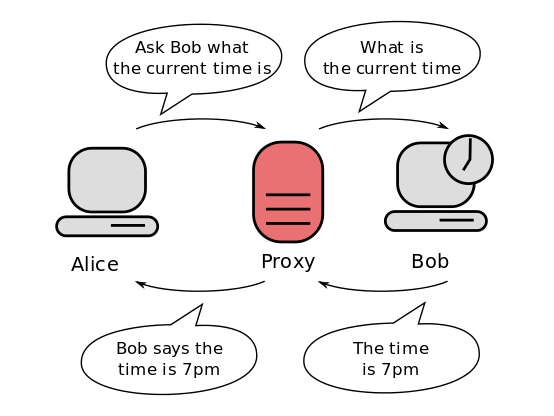
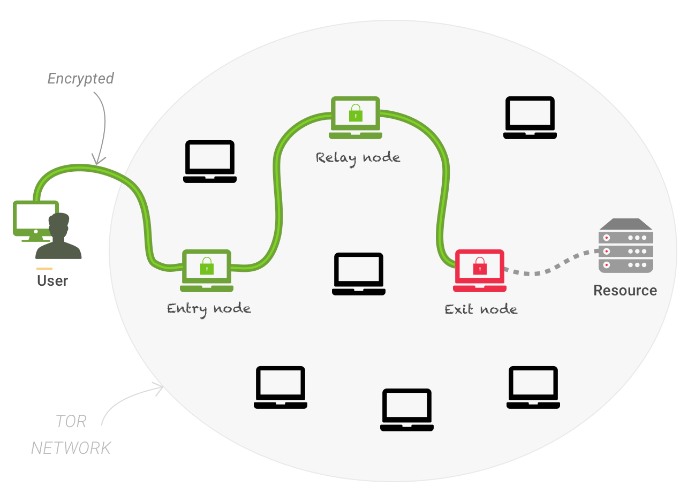

# VPN, proxies y red Tor. Qué diferencias hay y cuándo utilizarlas.

En el contexto de la seguridad y privacidad en línea, el uso de herramientas como VPNs, proxies y la red Tor juega un papel fundamental para proteger nuestros datos y nuestra identidad. Estas tecnologías permiten ocultar nuestra dirección IP, cifrar el tráfico de navegación y acceder a contenidos restringidos, ofreciendo diferentes niveles de anonimato y seguridad. En este capítulo, analizaremos el funcionamiento de cada una de estas herramientas, sus ventajas y limitaciones, así como los escenarios en los que es recomendable emplear cada una para reforzar nuestra protección en la red.

## Conceptos previos

Antes de explicar qué es una VPN, un proxy, la red TOR y cuáles son sus diferencias, vamos a explicar una serie de conceptos:

- **Dirección IP**: La dirección IP (Internet Protocol) es un identificador único que recibe un dispositivo cuando se conecta a Internet, similar a una dirección postal pero en el mundo digital. Sirve para que los datos puedan llegar al destino correcto, permitiendo que los dispositivos se comuniquen entre sí. Existen dos tipos principales: las IP públicas, que identifican la conexión a Internet de una red, y las IP privadas, que identifican dispositivos dentro de una red local, como la de casa. Así, la dirección IP permite rastrear tu actividad en línea y tu localización aproximada, por lo que protegerla es importante para tu privacidad.

- **Cifrado de datos**: El cifrado de datos es un proceso que convierte la información original en un formato ininteligible para que solo pueda ser leída por aquellas personas o sistemas que tengan la clave para descifrarlo. Funciona como un candado digital: la información es protegida mediante algoritmos matemáticos que la transforman en una cadena de caracteres aparentemente aleatoria.

  Por ejemplo, si envías un mensaje cifrado, aunque alguien lo intercepte, no podrá entenderlo sin la clave correcta para descifrarlo. Este proceso es fundamental para proteger la información cuando se transmite por Internet (como correos electrónicos o compras en línea) o cuando se almacena en un dispositivo, garantizando que sea segura y privada.

- **Servidor**: Un servidor es un ordenador o sistema informático diseñado para gestionar, almacenar y proporcionar datos, servicios o recursos a otros ordenadores o dispositivos llamados clientes. Se puede entender como un centro de control que proporciona lo que los clientes solicitan, ya sean páginas web, archivos, correos electrónicos u otro tipo de información. Por ejemplo: Cuando visitas un sitio web, tu navegador (cliente) hace una solicitud al servidor donde está almacenada la página, y este responde enviándote el contenido para que puedas visualizarlo. Si usas una aplicación de correo, esta se conecta al servidor de correo para enviar o recibir mensajes.

- **Rastreo en línea**: El rastreo en línea es el proceso mediante el cual las empresas, sitios web o plataformas recopilan y almacenan información sobre las actividades que realizas mientras navegas por Internet. Este seguimiento se realiza utilizando diferentes herramientas y tecnologías, como cookies, píxeles de seguimiento o scripts de rastreo, que registran datos sobre tus preferencias, hábitos de navegación e incluso tu localización.

  Por ejemplo, cuando visitas una tienda en línea, es posible que guarden información sobre los productos que consultaste o añadiste al carro. Más tarde, puedes ver anuncios de esos mismos productos en otros sitios web. Esto es un ejemplo de cómo funciona el rastreo en línea.

  Los datos que se pueden recopilar incluyen:

  - Las páginas web que visitas.

  - El tiempo que pasas en cada sitio.

  - Las búsquedas que haces.

  - Tu dirección IP, que puede indicar tu localización.

  - La información sobre el dispositivo y navegador que usas.

  El rastreo en línea puede tener diferentes fines:

  - Publicidad personalizada: Mostrar anuncios relevantes según tus intereses.

  - Análisis de datos: Mejorar servicios y comprender mejor el comportamiento de las usuarias.

  - Segmentación de usuarias: Crear perfiles detallados para ofrecer contenido u ofertas específicas.

- **Proveedor de Servicio de Internet (ISP)**: Un ISP (Proveedor de Servicio de Internet, por sus siglas en inglés Internet Service Provider) es una empresa o entidad que proporciona a las usuarias acceso a Internet. Básicamente, el ISP es la puerta que conecta tu red doméstica o dispositivo a la red global de Internet. Funciones principales de un ISP:

  - Acceso a Internet: El ISP ofrece conexiones a Internet a través de diferentes tecnologías, como DSL (líneas de suscripción digitales), cable, fibra óptica, conexiones satelitales o conexiones móviles.

  - Dirección IP: El ISP asigna una dirección IP (un identificador único en la red) al dispositivo de la usuaria. Esta dirección IP puede ser estática (siempre la misma) o dinámica (puede cambiar con cada conexión).

  - Servicios adicionales: Además del acceso a Internet, los ISP también pueden ofrecer servicios complementarios como correo electrónico, alojamiento web, VPN, o incluso acceso a televisión por cable o servicios de telefonía.

  **¿Cómo funciona un ISP?**

  Cuando una persona o empresa quiere acceder a Internet, contrata un ISP que le ofrece una conexión adecuada para sus necesidades. El ISP proporciona la infraestructura y los servidores necesarios para enrutar las solicitudes de conexión a través de diferentes redes hasta llegar al destino en la web. Su función también incluye mantener la infraestructura que permite la conexión, como routers, servidores DNS (para traducir los nombres de dominio en direcciones IP), y otros equipos que aseguran el buen funcionamiento de la conexión.

  **Rastreo a través del ISP:**

  Es importante notar que, cuando navegas por Internet, tu ISP puede ver el tráfico que envías y recibes, incluyendo los sitios web que visitas. Por lo tanto, el ISP puede rastrear y registrar tu actividad en línea.

- **Redes públicas y privadas** Es muy importante diferenciar entre redes públicas y privadas, ya que aunque el control de la privacidad es importante en ambos casos, en el caso de las redes públicas es clave:

  - **Red pública**: Una red pública es una conexión de red que está disponible para cualquier persona y, generalmente, no requiere permisos específicos para acceder a ella. Ejemplos típicos son redes Wi-Fi gratuitas en cafeterías, aeropuertos, bibliotecas u hoteles.

  - **Red privada**: Una red privada es una red restringida a la que solo pueden acceder usuarias autorizados. Estas redes suelen ser usadas en hogares, empresas o instituciones para ofrecer conexión segura y controlada a los dispositivos conectados.

- **Navegación pública vs navegación privada**

  La **navegación privada** es una funcionalidad que ofrecen la mayoría de los navegadores web para que las usuarias puedan navegar sin que se guarden ciertas informaciones en el dispositivo, como el historial de navegación, las cookies o los datos de los formularios. Características principales:

  - No se guardan datos locales: El navegador no almacena el historial de navegación, las cookies o los datos de sesión. Al cerrar la ventana de navegación privada, se borra todo.

  - Útil para sesiones temporales: Es útil si no quieres dejar rastro de tu actividad en el dispositivo, por ejemplo, cuando usas un computador público o compartido.

  - No protege contra rastreadores en línea: A pesar de que no se guardan los datos en el dispositivo, la navegación privada no oculta tu identidad o actividad en línea de los sitios web o de los proveedores de servicio de Internet (ISP)

  Esta navegación privada tiene una serie de limitaciones:

  - No evita que los sitios web rastreen tu actividad mediante la dirección IP o mediante otros mecanismos de rastreo como las huellas digitales del navegador.

  - No te proporciona anonimato o protección contra espiar tus datos.

  La **navegación anónima**, por otro lado, se refiere a técnicas o herramientas que ocultan tu identidad o información personal mientras navegas en la web. El objetivo principal es mejorar la privacidad, haciendo que sea más difícil rastrear tus actividades en línea. Para esto se emplean las VPNs o las redes TOR, que buscan añadir una capa de protección extra, y que explicaremos en detalle más abajo. Hay que tener en cuenta que este tipo de navegación puede reducir la velocidad de navegación, ya que el tráfico tiene que pasar por varios servidores antes de llegar a su destino. Además, por supuesto, no es infalible, y las autoridades u otras entidades podrían ser capaces de rastrear tu actividad con herramientas avanzadas.

- **Punto de acceso**: Un punto de acceso es un dispositivo que permite a los dispositivos, como teléfonos, ordenadores o tabletas, conectarse a Internet. Es decir, es nuestra puerta de entrada al resto de la red. Funciona como un puente entre los dispositivos y la red principal, transmitiendo y recibiendo señales.

## ¿Qué es una VPN?

Una **VPN** (Virtual Private Network, o Red Privada Virtual en español) es una tecnología que permite crear una conexión segura y cifrada entre un dispositivo (como un ordenador o un teléfono móvil) y un servidor remoto a través de Internet. Este servidor actúa como un punto de acceso a la red, permitiendo que los datos que se envían y reciben entre el dispositivo y la red pública (Internet) viajen de forma protegida y anónima.

La función principal de una VPN es **garantizar la privacidad y seguridad en la navegación en línea**, cifrando la comunicación entre la usuaria y el servidor de Internet, y haciendo que sea mucho más difícil para terceros, como cibercriminales o proveedores de servicios de Internet (ISPs), interceptar o espiar esa información.

### ¿Cómo funciona una VPN?

- **Cifrado de datos:** La VPN utiliza protocolos de cifrado para encriptar los datos que viajan entre el dispositivo de la usuaria y el servidor de la VPN. Esto significa que incluso si alguien intentase interceptar los datos en tránsito, no podría leerlos, ya que estarían codificados de manera que solo el servidor de destino o el dispositivo de origen puedan descifrarlos. Hay que tener en cuenta que no todos los servicios de VPN envían los datos de forma encriptada.

- **Túnel seguro:** La conexión establecida entre el dispositivo y el servidor de la VPN se llama un túnel. Este túnel es privado y protege los datos, haciendo que no sean accesibles a nadie que intente espiar o interrumpir la conexión. Esto impide que otras personas en la misma red (como en una red Wi-Fi pública) puedan acceder a tus datos o a lo que estás haciendo en línea.

- **Cambiar la dirección IP:** Una de las principales ventajas de una VPN es que puede ocultar tu verdadera **dirección IP**, que es un identificador único asociado a tu dispositivo cuando te conectas a Internet. Al conectarte a un servidor VPN, tu dirección IP real queda oculta y es sustituida por la dirección IP del servidor VPN. Esto puede mejorar tu privacidad en línea, haciendo más difícil para terceros rastrearte o determinar tu localización real.

- **Acceso a contenidos bloqueados:** Como tu dirección IP se sustituye por la del servidor VPN, también puede permitirte acceder a contenidos o servicios bloqueados en tu región geográfica. Por ejemplo, si un sitio web o servicio está disponible solo en Estados Unidos, pero tú estás en Europa, una VPN puede hacerte parecer que estás en EE.UU. para acceder a ese contenido.

- **Seguridad en la navegación en redes públicas:** Las VPNs son especialmente útiles cuando se usan redes Wi-Fi públicas, como las que se encuentran en cafés, aeropuertos o bibliotecas. En este tipo de redes, la seguridad es mucho más débil y los cibercriminales pueden intentar interceptar la comunicación. La VPN protege tus datos al cifrarlos y asegurar que no sean fácilmente accesibles.

### Limitaciones y desventajas de una VPN

- **Velocidad:** Al usar una VPN, puede haber una disminución de la velocidad de navegación debido al cifrado y al paso de los datos por el servidor remoto. Esto puede ser un problema cuando se realizan tareas que requieren mucho ancho de banda, como la transmisión de vídeo en alta definición.

- **Confianza en el servidor VPN:** Al utilizar una VPN, estás confiando en el servidor de la VPN para proteger tu privacidad. Si el servidor VPN no está bien protegido o si el proveedor de VPN mantiene registros de actividad, la privacidad de la usuaria puede verse comprometida.

- **Accesibilidad a servicios:** Algunos servicios, como plataformas de transmisión de vídeo o sitios web, pueden bloquear las conexiones VPN para evitar que las usuarias accedan a contenidos restringidos por región.

En resumen, una **VPN** es una herramienta útil para mejorar la seguridad y la privacidad en línea, cifrando la comunicación y ocultando tu dirección IP, pero también presenta algunas limitaciones que deben tenerse en cuenta al utilizarla.

### ¿Qué VPN usar?

Existen múltiples opciones de herramientas VPN. En esta guía nos vamos a centrar en [Proton VPN](https://protonvpn.com/) y [Mullvad](https://mullvad.net/en/vpn), dos de las más conocidas y con mejor reputación:

-  [ProtonVPN](https://protonvpn.com/): Es la VPN del ecosistema Proton, con sede en Suiza. Tiene una versión gratuita que contiene las principales funciones que necesitas para un uso básico. Entre los diferentes protocolos que permite emplear (decide automáticamente cuál usar en cada situación), se encuentra el protocolo [stealth](https://protonvpn.com/blog/stealth-vpn-protocol), especialmente útil para conectarte a internet en espacios donde el empleo de VPN está bloqueado. Este protocolo está disponible en todas las plataformas salvo en GNU/Linux, así que si empleas GNU/Linux y te encuentras en un entorno en el que la VPN de Proton está bloqueada, necesitarás emplear la VPN que se indica a continuación.

-  [Mullvad VPN](https://mullvad.net/en/vpn): Otra de las VPN más destacadas en cuanto a privacidad. Su sede está en Suecia, aunque puedes conectarte a servidores de países de todo el mundo. A diferencia del caso de ProtonVPN, solo tiene plan de pago (5€/mes). Cuenta con múltiples protocolos de comunicación, lo que hacen que funcione incluso en entornos donde el empleo de VPN está bloqueado. [En este enlace](https://mullvad.net/en/help/connecting-to-mullvad-vpn-from-restrictive-locations) podéis ver más información sobre el empleo de Mullvad en este tipo de entornos.

En el caso de que sepas con antelación que vas a estar en un entorno donde las VPN están bloqueadas, es recomendable que configures previamente la VPN en tus dispositivos. Además, es buena práctica tener dos VPN, para tener una segunda opción en el caso de que falle la primera.

## ¿Qué es un Proxy?

Un **proxy** es un servidor que actúa como intermediario entre un cliente, como un ordenador o un dispositivo móvil, y un servidor al que se quiere acceder a través de Internet. En otras palabras, cuando una usuaria hace una solicitud para acceder a un sitio web o servicio en línea, el proxy reenvía esta solicitud en nombre de la usuaria, recoge la respuesta del servidor y luego envía la información de vuelta a la usuaria.

Este proceso tiene varias funciones y beneficios, tales como:

- **Privacidad y anonimato:** El proxy oculta la dirección IP de la usuaria, haciendo que las solicitudes a Internet parezcan venir del propio proxy y no del dispositivo de la usuaria. Esto puede ser útil para mejorar la privacidad en la navegación y para evitar que se rastreen las actividades de la usuaria en línea.

- **Control de acceso:** El proxy puede bloquear el acceso a sitios web específicos o filtrar el contenido basado en políticas de acceso, como las que se implementan en redes corporativas o en escuelas.

- **Mejora del rendimiento:** Un proxy puede almacenar en caché (o guardar localmente) las páginas o recursos web más solicitados. Esto significa que cuando otra usuaria hace la misma solicitud, el proxy puede entregar el contenido directamente desde su caché, mejorando la velocidad de acceso y reduciendo el uso de ancho de banda.

- **Seguridad adicional:** Al actuar como intermediario, un proxy puede ofrecer ciertas medidas de seguridad, como la detección de sitios maliciosos, el análisis de tráfico para encontrar posibles amenazas y la protección contra ciertos tipos de ataques.

Sin embargo, aunque los proxies ofrecen ciertos beneficios, **también tienen limitaciones importantes en comparación con otras tecnologías como las redes privadas virtuales (VPNs)**. La principal diferencia es que un proxy no cifra la conexión entre la usuaria y el servidor. Esto significa que, a diferencia de una VPN, la comunicación a través de un proxy no está protegida contra la escucha por terceros, por lo que no ofrece la misma seguridad en conexiones sin cifrar.

En resumen, un proxy es útil para mejorar la privacidad, controlar el acceso a sitios web y mejorar el rendimiento, pero no proporciona el nivel de seguridad y privacidad que se puede obtener con una VPN.

## ¿Qué es la Red TOR?

La [**red TOR** (The Onion Router)](https://www.torproject.org/) es una red descentralizada de servidores que permite la navegación anónima en Internet. Su principal objetivo es proporcionar a las usuarias la capacidad de navegar sin que su identidad o actividad sean rastreadas. El funcionamiento de TOR se basa en el uso de múltiples capas de cifrado, que actúan como lóbulos de una cebolla, de ahí el nombre onion routing, enrutamiento de cebolla.

### Proceso de cifrado

Cuando una usuaria envía datos a través de TOR, estos son cifrados en múltiples capas, de forma similar a las capas de una cebolla. Cada nodo de la red TOR solo puede descifrar una de las capas, garantizando que ningún nodo intermedio tenga acceso al contenido completo de la comunicación ni a su origen y destino final al mismo tiempo. El **proceso de cifrado** funciona así:

- La usuaria TOR elige un camino aleatorio de nodos de la red (por defecto son tres nodos, aunque se puede incrementar el número).

- El tráfico es cifrado usando un **cifrado en capas**, aplicando una capa de cifrado para cada nodo por el que pasará el tráfico.

- El primer nodo de la ruta (nodo de entrada) descifra la primera capa, pero solo sabe quién es el usuario y el siguiente nodo de la ruta.

- El segundo nodo elimina su capa de cifrado, pero solo sabe de dónde vino el mensaje (el primer nodo) y a quién debe enviarlo (el tercer nodo).

- El tercer nodo (nodo de salida) elimina la última capa de cifrado y envía el tráfico a su destino final en internet.

Este proceso de enrutamiento múltiple y cifrado en cada paso hace que, al final, el origen de la solicitud se vuelva irreconocible para el servidor de destino, ya que el tráfico es cifrado en múltiples capas y enviado a través de varios puntos en la red antes de llegar a su destino. Además, hay algunos servicios que se encuentran directamente dentro de la red TOR, los dominios terminados en .onion, de forma que en ningún momento es preciso salir de la red TOR.

### Ventajas de la red TOR

Las principales **ventajas de la red TOR** son las siguientes:

- **Anonimato:** Al pasar a través de varios nodos, la dirección IP de la usuaria queda oculta, haciendo imposible rastrear su localización o su identidad a través de su conexión a la red. Esto hace que TOR sea popular entre las usuarias que desean mantener su anonimato en línea.

- **Evasión de censura:** TOR permite a las usuarias acceder a sitios web y servicios bloqueados o censurados en algunos países o redes, ya que oculta su identidad y origen. Esto es especialmente útil para periodistas, activistas y usuarias que operan en países con altas restricciones de acceso a la información.

- **Seguridad mejorada:** La comunicación a través de la red TOR está cifrada en varias capas, lo que proporciona una protección adicional contra escuchas y ataques. Esto es útil especialmente cuando se accede a sitios web sensibles o se intercambian datos confidenciales.

### Desventajas de la red TOR

Sin embargo, la red TOR también presenta ciertas desventajas (hay que recordar que la seguridad al 100% no existe):

- **Velocidad de conexión**: La principal de ellas es que, debido al enrutamiento en múltiples capas y nodos, la velocidad de navegación puede ser considerablemente más lenta en comparación con otras formas de navegación en Internet.

- **Vulnerabilidad al salir de la red TOR**: TOR no garantiza la seguridad total, ya que los nodos de salida de la red pueden ser vulnerables a ataques, y el tráfico encriptado solo se mantiene seguro entre los nodos de la red, pero no en el nodo de salida, donde se descifra y puede ser escuchado por partes mal intencionadas. Sin embargo, en este caso, aunque podrían saber a qué recurso se está accediendo, no podrían saber quién está accediendo, ya que ha pasado a través de varios nodos TOR. En el caso de acceder a **dominios .onion**, no se llega a salir de la red TOR, por lo que ya no existe tal vulnerabilidad.

- **Nodos maliciosos**: Otra vulnerabilidad es que un atacante con control de múltiples nodos podría intentar relacionar el tráfico de entrada y salida, aunque tendría que coincidir que justo la ruta pase a través de los nodos de un mismo atacante.

En resumen, la red TOR es una herramienta poderosa para mantener el anonimato y la privacidad en línea, pero también tiene limitaciones en términos de velocidad y seguridad en el nodo de salida. Su utilización es recomendada para aquellas usuarias que desean acceder a Internet de forma anónima o eludir la censura en línea. Para poder emplearla, debes descargar el navegador desde su [página oficial](https://www.torproject.org/).

## Comparativa entre VPN, Proxy y red TOR

| **Característica**    | **VPN**                                            | **Proxy**                                                              | **Rede TOR**                                                                         |
|:----------------------|:---------------------------------------------------|:-----------------------------------------------------------------------|:-------------------------------------------------------------------------------------|
| **Anonimato**         | Alto: Oculta la IP y cifrado completo              | Medio: Oculta la IP, pero no cifra todo el tráfico                     | Alto: Oculta la IP y cifra todo el tráfico                                           |
| **Seguridad**         | Alto: Cifrado de todo el tráfico                   | Bajo: Solo oculta la IP, sin cifrado                                   | Alto: Cifrado de múltiples capas y anonimato                                         |
| **Rendimiento**       | Medio: Ligeramente más lento debido al cifrado     | Rápido: Sin cifrado, pero puede ser más lento dependiendo del servidor | Lento: Debido al enrutamiento de múltiples nodos                                     |
| **Accesibilidad**     | Accede a cualquier sitio                           | Accede a sitios específicos a través del servidor proxy                | Accede a sitios censurados o bloqueados                                              |
| **Censura**           | Elude la censura, pero depende del proveedor       | Elude la censura, pero solo si está configurado correctamente          | Elude la censura de forma eficaz, ocultando el origen del tráfico                    |
| **Facilidad de uso**  | Relativamente sencillo de configurar               | Sencillo de configurar, pero con limitaciones                          | Requiere software especializado (Tor Browser)                                        |
| **Privacidad**        | Alta, pero depende del proveedor de VPN            | Baja: el servidor puede registrar la actividad                         | Alta, ya que no hay un único punto de fallos que registre la actividad               |
| **Compatibilidad**    | Funciona con cualquier aplicación que use Internet | Funciona principalmente para HTTP/HTTPS, es decir, navegadores.        | Funciona principalmente con el [navegador Tor](https://www.torproject.org/download/) |
| **Herramienta libre** | [Proton VPN](https://protonvpn.com/)               | \-                                                                     | [Navegador Tor](https://www.torproject.org/download/)                                |

Comparativa entre VPN, Proxy y Red TOR
