# Alternativas libres e encriptadas 

<figure>
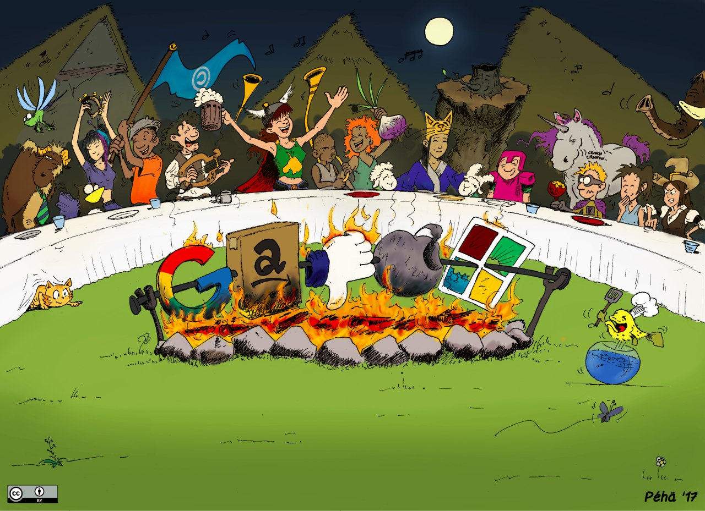
<figcaption><a href="https://commons.wikimedia.org/w/index.php?curid=79135607">Peha-Banquet-Degooglisons-CC-By</a> por Peha está licenciada baixo <a href="https://creativecommons.org/licenses/by-sa/4.0/?ref=openverse">CC BY-SA 4.0.</a></figcaption>
</figure>

Sabías que é posible vivir sen empregar ferramentas que non sexan de Google ou de Microsoft? Preguntaraste que ten de malo usar este tipo de ferramentas, tan empregadas hoxe en día polo conxunto da poboación. Neste caso o problema non é tanto de seguridade (que tamén), se non que máis ben trátase dun tema de privacidade. Estas compañías, como moitas outras, ofrecen gran parte dos seus servizos completamente de balde. Sen embargo, como se soe dicir, se o produto é de balde, en moitas ocasión o produto es ti.

Estas compañías recopilan unha elevada cantidade de datos das persoas usuarias do seu servizo para logro sacarlles rendibilidade a través de publicidade, venda a terceiras partes, etc. Hai exemplos claros, coma de o [Cambridge Analytica](https://www.elsaltodiario.com/redes-sociales/cambridge-analytica-facebook-injerencias-elecciones-estadounidenses) onde grandes empresas coma Meta (a antiga Facebook) empregou os datos dos seus milleiros de usuarias para logo influír nos resultados do BREXIT ou das primeiras eleccións dos Estados Unidos de América nas que saíu elixido Donald Trump. Por outra banda [Google e Amazon](https://www.elperiodico.com/es/internacional/20231212/proyecto-nimbus-militar-google-amazon-israel-guerra-palestina-gaza-protesta-95733715) colaboraron co estado xenocida de Israel na identificación de obxectivos dándolle acceso aos seus servizos da nube. E coma estes moitos exemplos máis. E preguntaraste, que alternativas teño? Pois aí é onde entran os servizos libres.

Antes de comenzar hai que deixar unha cousa clara. Nin todas as aplicación de balde son libres, nin todas as aplicación libres son de balde. O concepto de liberdade está directamente relacionado co respecto da privacidade das persoas usuarias. Un software é libre [cando se pode executar, copiar, distribuír, estudar, modificar e mellorar](https://www.gnu.org/philosophy/free-sw.es.html#top). Polo tanto, o simple feito de que unha aplicación sexa gratis, non quere dicir que sexa libre.

Ademais, aínda que en moitos casos sucede, que unha aplicación sexa libre non quere dicir que sexa gratuíta. Hai aplicacións libres que ofrecen un servizo completamente de pago, ou que ofrecen unha versión gratuíta con limitacións. Sen embargo, esta versión gratuíta tende a ser máis que suficiente para o uso habitual que se lle soe dar. Hai que pensar que estas aplicacións tamén chegan a ter unha serie de custos asociado, como pode ser os servidores aos que nos conectamos de forma gratuíta para empregar algún tipo de servizo.

Logo está a importancia de entender ben o concepto da nube. A nube non é máis ca un conxunto de ordenadores conectados entre si. Cando ti gardas algo na nube, realmente o que estás facendo é gardalo nun ordenador central (que chamaremos servidor) que está noutro lugar xeográfico. O mesmo sucede cando envías unha mensaxe a outra persoa. A mensaxe non vai directa ata a outra persoa, se non que o que fas é envialo a un ordenador central (coñecido como servidor), e logo dende aí é enviado á persoa destinataria. En moitas ocasións, ademais, unha copia da mensaxe permanece gardada no servidor, para que por exemplo poidas acceder dende outro dispositivo.

Esto é algo que debemos ter en conta para comprender a importancia de conceptos como o de que os datos estean encriptados. É que isto dos datos encriptados? Falamos de servizos encriptados cando a empresa ou entidade que nos ofrece o servizo non ten acceso de ningún tipo de dato relativo ao noso uso. Neste caso é importante distinguir entre varios tipos de encriptado:

- **Encriptado en tránsito:** os datos están encriptados durante o envío dende o noso dispositivo ata o servidor central. Isto permite que aínda que alguén intercepte a mensaxe ou ficheiro polo camiño, non poida acceder ao ser contido.

- **Encriptado en repouso:** os datos son encriptados mentres están no servidor central. É dicir, a empresa que ofrece o servizo non pode acceder aos meus datos almacenados no seu servidor. Por exemplo, un servizo de almacenamento de imaxes con encriptado en repouso evita que a empresa poida acceder ao contido das miñas fotos almacenadas.

- **Encriptado no dispositivo:** os datos están encriptados mentres están no noso dispositivo. Isto garante que outras aplicacións non poidan acceder a eles.

O importante é empregar servizos que aplican todas eses encriptados de forma simultánea, o que se coñece como **encriptado de extremo a extremo**, sendo as súas siglas en inglés E2EE (End to End Encryption). Isto garante que a empresa non ten ningún tipo de acceso aos nosos datos.

Tamén existe a opción de autoaloxar os nosos servizos, é dicir, en lugar de depender de servidores externos de correo, calendario, almacenamento, etc, podemos ter o noso propio servidor ao que acceder remotamente. Relacionado con isto xorde o concepto de redes federadas, que consiste nun punto intermedio entre usar un servidor completamente externo e usar o teu propio servidor. Isto consiste en comunidades que se poñen de acordo para xestionar os seus propios servidores, podendo estar conectados ata certo punto cos servidores doutras comunidades.

Pero claro, preguntaraste: **E que alternativas teño?** Pois ben, a continuación imos detallar unha serie de alternativas libres a algún dos servizos de Google e Microsoft máis empregados hoxe en día baseándonos na nosa experiencia, tendo en conta a seguridade e facilidade de uso.

## Grandes conxuntos de ferramentas

Antes de comezar coa distintas alternativas existentes para cada tipo de servizo (correo, navegador, calendario, etc.) imos destacar algúns proxectos e conxuntos de ferramentas libres que conteñen distintas aplicacións de gran utilidade.

###  [F-Droid](https://f-droid.org/es/)

Consiste nun catálogo de aplicacións libres para Android, é dicir, sería unha especia de Google Play Store pero que só contén aplicacións libres. Podémolo descargar directamente dende a súa [web](https://f-droid.org/es/). Durante a instalación aparecerannos unha serie de mensaxes de seguridade dos cales non nos temos que preocupar. Algunhas das aplicacións que se recomendan nesta guía so poden ser descargadas dende o F-Droid, polo que se recomenda a súa instalación.

###  [Aurora Store](https://gitlab.com/AuroraOSS/AuroraStore)

É probable que en moitas ocasións non che quede máis remedio ca instalar algunha aplicación (libre ou non), que so se pode descargar dende o Google Play Store. Aurora Store, dispoñible en F-Droid, permíteche descargar e instalar calquera aplicación dispoñible do Google Play Store sen necesidade de dispoñer dunha conta de Google, o que aumenta a nosa privacidade.

###  [Fossify](https://www.fossify.org/)

En todos os dispositivos móbiles hai un serie de ferramentas imprescindibles independentemente do uso que lle vaiamos dar. Estas ferramentas son precisamente as que forman o conxunto de Fossify: galería de imaxes, calendario, contactos, notas, xestor de arquivos, reprodutor de música, SMS, gravadora de voz, cámara, calculadora, alarma, teclado, marcador... Sen dúbida un dos proxectos máis destacados de ferramentas libres para dispositivos móbiles, e que non ten nada que envexar ás que nos ofrece Google. Fossify xurdiu como alternativa ao conxunto de ferramentas Simple Mobile Tools, despois de este último fose mercado pola empresa israelí ZipApps, a cal introduciu publicidade e opcións de pago.

###  [FramaSoft](https://framasoft.org/gl/)

Outra compoñente clave no noso día a día son as plataformas colaborativas, sendo Framasoft un dos principais proxectos actuais neste campo. É unha asociación francesa sen ánimo de lucro fundada no 2004 e que busca DesGooglizar internet, ofrecendo un amplo conxunto de ferramentas en liña, como un pad colaborativo, unha axenda colaborativa, servizo de listas de correo, videochamadas ou un xestor de eventos, entre moitas outras. Na sección [DesGooglisons](https://degooglisons-internet.org/gl/) podes atopar as distintas alternativas que ofrecen. Hai que ter en conta que estas ferramentas non teñen encriptado extremo a extremo.

###  [Proton](https://proton.me)

Naceu en Suíza no 2014 cando un conxunto de persoal científico do CERN decidiu construír unha mellor internet baseada na privacidade. Conta cun servizo de correo electrónico, calendario, almacenamento na nube, xestor de contrasinais e VPN, todos eles encriptados para garantir a privacidade das persoas usuarias.

### 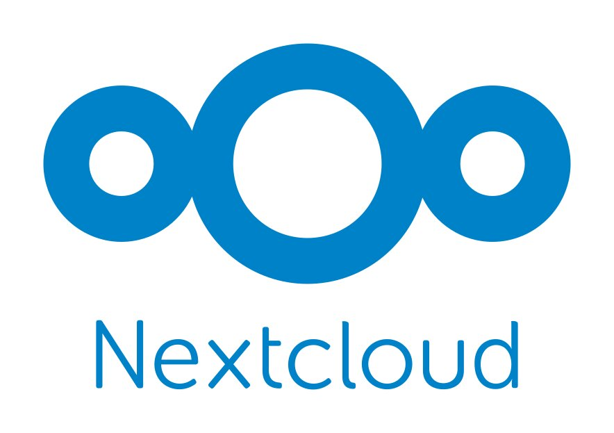 [NextCloud](https://nextcloud.com/)

Nextcloud é un conxunto de programas que permiten a creación de servizos de aloxamento de arquivos. A súa funcionalidade é similar ao software Dropbox ou Google Drive, coa diferenza de que Nextcloud é libre. Conta con moitas ferramentas, como edición de documentos de forma colaborativa, notas, taboleiro de tarefas, videochamadas, etc. Para poder empregala hai que instalala nun servidor propio, ou contratar a alguén que ofreza tal servizo.

###  [Disroot](https://disroot.org/)

Disroot é un proxecto radicado en Amsterdam que ofrece un amplo conxunto de servizos libres. Ao igual que sucede no caso de Framasoft, os datos non están encriptados extremos a extremo, o que se debe ter en conta á hora de empregar os servizos. Sen embargo, nalgún casos, isto non ter por que ser un problema. [Neste enlace](https://disroot.org/es/#services) tes o conxunto de ferramentas que ofrecen.

## Alternativas por tipo de servizo

Unha vez presentados cinco dos proxectos máis destacados de ferramentas libres (hai moitos máis), toca pasar ás alternativas específicas para cada servizo.

### Ferramentas para aforrar empregar a nube

Cando empregamos servizos en Internet proporcionados por terceiras partes, expoñemos a nosa privacidade trasladando información sobre as nosas actividades ás entidades que xestionan o servizo, ás que xestionan os recursos informáticos empregados e ás operadoras das redes de telecomunicación polas que a viaxa a información.

Ademais, en moitos casos pode supoñer un gasto innecesario de recursos: se enviamos unha foto a unha persoa que está sentada ao noso carón empregando o servizo de mensaxería de moda, faremos que a foto viaxe a servidores de EE.UU. para regresar novamente desfacendo o camiño ata chegar ao teléfono da persoa destinataria.

Existen ferramentas libres que nos permiten compartir contidos con outras persoas, ou manter sincronizadas carpetas en diferentes dispositivos minimizando a exposición da nosa privacidade e o consumo de recursos necesarios na rede Internet.

#####  [LocalSend](https://localsend.org/)

É unha aplicación que podes empregar nos teus ordenadores e teléfonos para enviar puntualmente todo tipo de contidos dun dispositivo a outro. Só funciona entre dispositivos que estean conectados na mesma rede e teñan instalada a aplicación. Os datos enviados viaxarán dun ao outro dispositivo sen pasar por Internet, reducindo os riscos de privacidade e os recursos consumidos, e evitando que a saturación nos recursos de Internet afecte á velocidade do envío.

É unha boa opción para enviar ficheiros puntualmente entre os teus dispositivos ou aos dispositivos das persoas coas que adoitas compartir espazo (mesma rede WiFi).

#####  [Syncthing](https://syncthing.net/)

Permite manter sincronizados o contido de carpetas en diferentes dispositivos, xa sexan ordenadores ou teléfonos móbiles. Os dispositivos poden estar na mesma rede ou en diferentes lugares do planeta. Syncthing busca o camiño a través de Internet para conectalos e sincronizar os contidos. Os requisitos son que os dispositivos a sincronizar estean acendidos simultaneamente o tempo necesario para sincronizar os datos. Se os datos se sincronizan en máis de dous dispositivos, Syncthing irá sincronizando a información puntualmente nos dispositivos que permanezan acendidos en cada momento.

Syncthing emprega unha tecnoloxía similar á rede Torrent, co que consegue sincronizar só as partes da información que cambian en cada momento sen necesidade de enviar novamente o arquivo enteiro. Ademais, tarda o mesmo tempo en sincronizar dous ordenadores ou vinte, o que o fai moi interesante para compartir carpetas con contidos cambiantes entre grupos ou equipos de persoas.

Pode ser unha boa opción para compartir carpetas entre grupos persoas de xeito eficiente e privado ou para manter sincronizados contidos entre os teus propios dispositivos.

##### 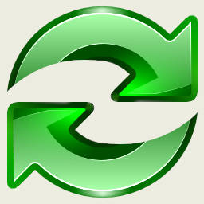 [FreeFileSync](https://freefilesync.org/)

Ferramenta multiplataforma (GNU/Linux, Android, Windows e Mac) para a xestión de copias de seguridade. Simplemente lle tes que indicar de que carpeta queres facer unha copia de seguridade e onde queres facela, e automaticamente fai a copia de seguridade dos arquivos novos. [Nesta sección](https://freefilesync.org/manual.php?topic=synchronization-settings) da súa web explican os diferentes modos que ten a aplicación para realizar as copias de seguridade. E na súa web tamén teñen unha serie de titoriais de explicando o funcionamento da ferramenta.

### Correo electrónico

#####  [Proton Mail](https://proton.me/mail)

É o servizo de correo pertencente ao conxunto de Proton. Está cifrado de extremo a extremo para garantir a privacidade dos datos, e o plan de balde consta de 1 GB para almacenamento. Esto é máis que suficiente, especialmente si se mantén limpa a bandexa de entrada. En caso de ser necesario consta de varios plans de pago para aumentar o espazo dispoñible.

##### 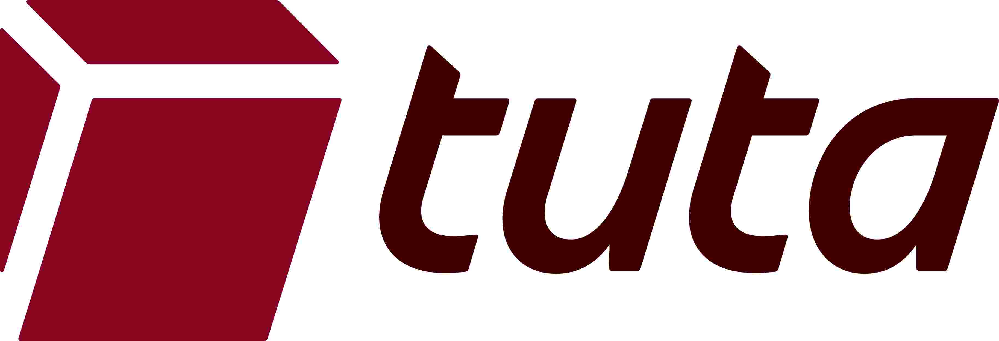 [Tuta Mail](https://tuta.com/secure-email)

Tuta é outra das grandes alternativas de correo electrónico cifrado extremo a extremo. O plan de balde ofrece 1 GB de almacenamento. Ademais, o plan de balde so permite crear unha conta de correo por persoa.

#####  [Thunderbird](https://www.thunderbird.net/gl/)

Cando falamos de correo electrónico cómpre diferenciar entre servizo de correo e cliente (a aplicación onde o consultamos). No caso de Proton, ofrécenos tanto o servizo de correo como o cliente para este servizo, coma no caso de Gmail. Sen embargo, en ocasións temos outros correos que queremos levar no noso dispositivo móbil, como pode ser o correo da universidade ou o do traballo. É aquí onde aparece Thunderbird, un cliente de correo libre para consultar os correos no noso móbil ou no ordenador. Cabe destacar que está desenvolvido pola Fundación Mozilla, máis coñecida polo neu navegador web: Firefox.

#####  [Fair Email](https://email.faircode.eu/)

So dispoñible para Android. É un cliente de correo electrónico, non ofrece servizo de correo

### Calendario

#####  [Proton Calendar](https://proton.me/calendar)

Como vos poderedes imaxinar, tamén pertence ao conxunto de Proton, e tamén está encriptado. Ten todas as función que se soen necesitar dun calendario: accesible en liña, creación de eventos colaborativos (incluso con persoas que non usen Proton), recordatorios, etc.

#####  [Tuta Calendar](https://tuta.com/es/calendar)

Ao igual ca no caso do correo, Tuta é outras das alternativas de correo na nube encriptado.

#####  [Calendario de Fossify](https://github.com/FossifyOrg/Calendar)

Ao igual ca no caso do correo electrónico, cando falamos de calendario hai que diferenciar entre servizo e cliente. Proton Calendar ofrécenos un servizo de calendario e un cliente para este servizo, pero pode darse o caso de que teñamos outros calendarios online asociados por exemplos á conta do traballo. E é aquí onde entra o Calendario do conxunto de Fossify permitíndonos ver e editar eses outros calendarios.

#####  [Calendario de Nextcloud](https://apps.nextcloud.com/apps/calendar)

Ferramenta do entorno Nextcloud que permite crear calendarios colaborativos. Ideal para cando precisas compartir un calendario publicamente. Para empregalo podes instalar NextCloud nun servidor ou empregar unha das múltiples instancias en aberto, como [framagenda.org](https://framagenda.org/apps/calendar/) ou [a de Disroot.org](https://cloud.disroot.org).

##### 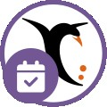 [Framadate](https://framadate.org/abc/gl/)

Framadate non é un calendario como tal, se non unha ferramenta para decidir a data para un determinado evento.

### Mensaxería instantánea

#####  [Matrix](https://matrix.org/)

Outros dos servizos imprescindibles é o da mensaxería instantánea. Matrix é un protocolo de comunicación seguro, descentralizado e encriptado para mensaxería. Para ser empregado é necesario instalar algún dos clientes (unha aplicación) que indican na súa [páxina](https://matrix.org/ecosystem/clients/). [Element](https://element.io/) é un dos clientes máis coñecidos e empregados. É multiplataforma, podendo ser empregado tanto dende o ordenador coma dende un dispositivo móbil. Un detalle a ter en conta é o feito de que non se require un número de teléfono móbil para rexistrarse. Unha das vantaxes do servizo de Matrix sobre o seguinte, Signal, é que Matrix permite a descentralización do servizo. É que é isto da descentralización? Diso falamos en detalle no capítulo [O Fediverso: a rede social alternativa](fediverso.md#cap:fediverso).

#####  [Signal](https://signal.org/)

É un servizo de mensaxería instantánea para móbiles que destaca polo protocolo de encriptado propio, dispoñible en aberto. Permite crear tanto grupos como conversas privados. Para rexistrarse é necesario introducir un número de teléfono móbil.

Por que non incluímos **Telegram**? Consideramos que Telegram non se pode considerar unha ferramenta de comunicación segura, xa que non é encriptada extremo a extremo. Si que é certo que ten a opción de conversa segura entre dúas persoas que si que é encriptada extremo a extremo, mais por defecto as conversas entre dúas persoas non son neste modo seguro. Ademais, as conversas de grupos non teñen opción de ser encriptadas extremo a extremo.

### Videochamadas

#####  [Jitsi](https://jitsi.org/)

Algo que se volveu moi habitual no noso día a día son as videochamadas, e parece que veu para quedarse. Jitsi permite a conexión por vídeo e audio, a gravación das sesións, chat interno e moitas outras funcións. Pódese autoaloxar nun servidor propio ou usar un dos múltiples servidores que hai en aberto, coma [o xestionado polo propio equipo de Jitsi](https://meet.jit.si/). Non é necesario instalar nada para empregalo. A xente de Disroot tamén ofrece [un servidor](https://calls.disroot.org/).

##### 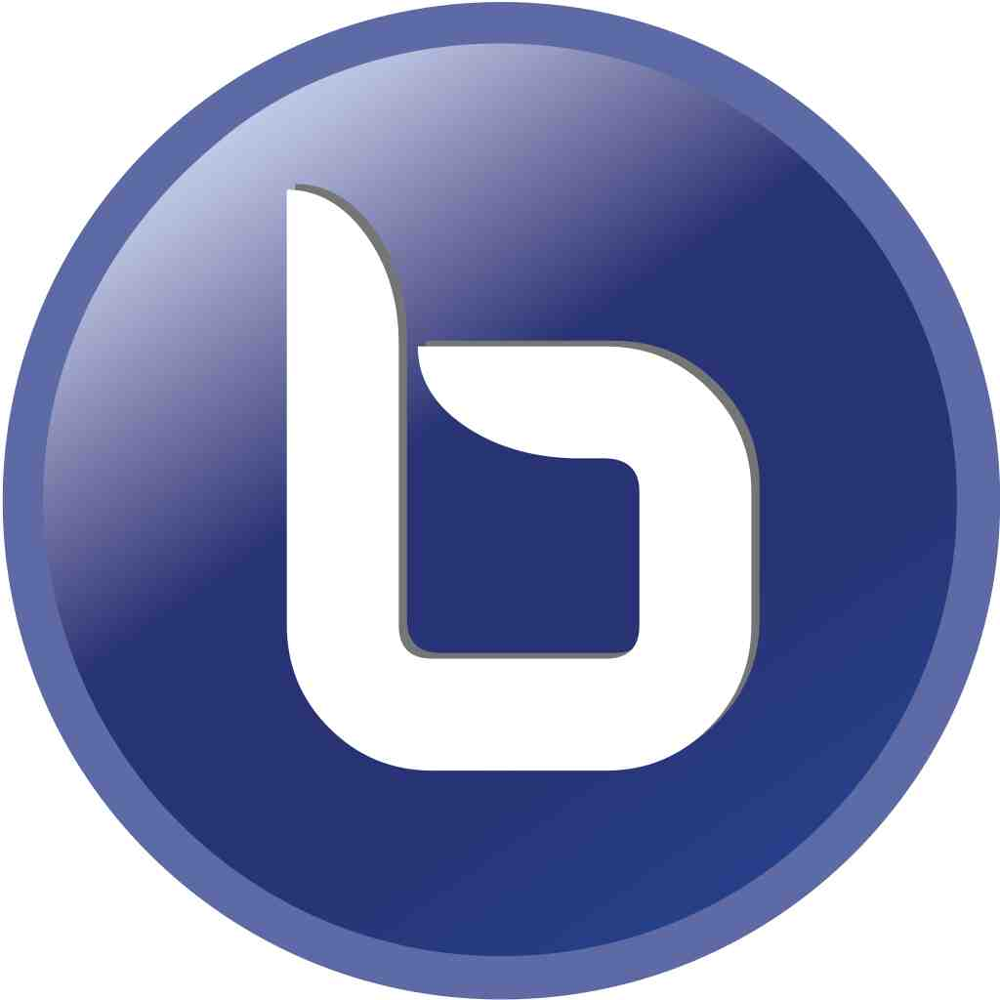 [BigBlueButton](https://bigbluebutton.org/)

Probablemente o servizo de videochamadas libre máis potente. Está especialmente pensado para o sector educativo, aínda que é empregado tamén no resto de campos. Permite tamén a comunicación por vídeo e audio, ademais dunha xanela na que ir amosando unha presentación en PDF sen necesidade de compartir pantalla, especialmente útil en situacións con baixa velocidade de internet. Tamén conta dunha opción para gravar as sesións. Para usala é necesario instala nun servidor ou ben buscar algún servidor aberto.

#####  [VDO.Ninja](https://vdo.ninja/)

Inda que a ferramenta está máis pensada para compartir a nosa cámara web con outro dispositivo, tamén permite empregala para facer videochamadas. Ten a vantaxe que o vídeo se transmite punto a punto, sen sobrecargar o servidor (que solo serve para poñer en contacto ás partes). Cando creamos unha sala permítenos editar unha serie de parámetros como se lle pedimos á xente que poña un nome que se amose na pantalla. Para empregala podemos usar [a propia instancia oficial](https://vdo.ninja/) ou algunha que haxa en aberto.

### Ofimática

##### 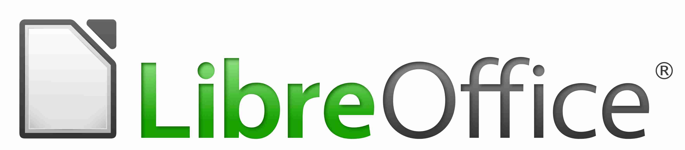 [LibreOffice](https://gl.libreoffice.org/home/)

A suite de ofimática libre máis coñecida e potente. Conte todo tipo de ferramentas: editor de texto, folla de cálculo, presentacións, etc. A algunhas de vós soaravos tamén OpenOffice, pero este é un proxecto abandonado, e [recoméndase cambiar a LibreOffice](https://www.libreoffice.org/discover/libreoffice-vs-openoffice/). Ademais, se é a vosa primeira vez co LibreOffice, ou se queredes afondar un pouco máis, teñen [un conxunto de guías moi útiles](https://documentation.libreoffice.org/es/documentacion-en-espanol/iniciacion/).

##### 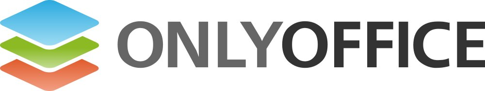 [OnlyOffice](https://www.onlyoffice.com/es/download-desktop.aspx)

Outra suite de ofimática libre, menos coñecida e potente. Conten tamén todo tipo de ferramentas: editor de texto, folla de cálculo, presentacións, etc. A interface gráfica é máis semellante á do Microsoft Office. Unha das principais desvantaxes é que non emprega [formatos libres de arquivos](https://es.libreoffice.org/descubre/opendocument/), se non que emprega os formatos de Microsoft.

##### 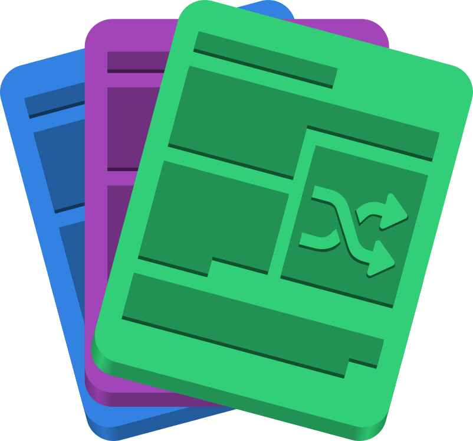 [PDF Arranger](https://github.com/pdfarranger/pdfarranger)

Ferramenta de escritorio para unir varios PDF. Tamén permite converter imaxes a PDF.

### Ofimática colaborativa

##### 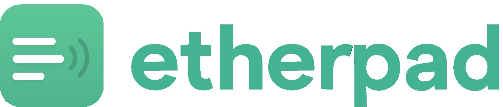 [Etherpad](https://etherpad.org/)

Editor en liña colaborativo, permitindo a múltiples persoas editar á vez un documento. Para empregala, ou ben se instala nun servidor dende cero, ou ben se emprega algunha das múltiples instancias que hai dispoñibles, como da de [Framapad](https://framapad.org/abc/gl/) ou [o pad de Disroot](https://pad.disroot.org/). Neste caso os pads non están encriptados.

##### 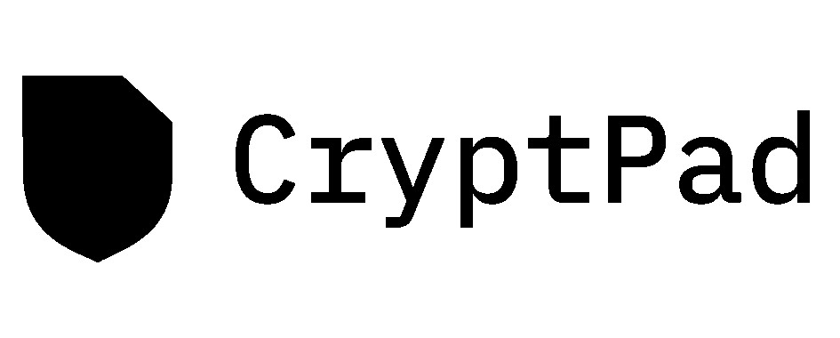 [Cryptpad](https://cryptpad.org/)

Outra das ferramentas para editar de forma colaborativa, na que neste caso os pads están encriptados extremo a extremo. Tamén permite crear follas de cálculo, taboleiros kanban, etc. Para empregala sen instala nun servidor, podes empregar unha das [múltiples instancias](https://cryptpad.org/instances/) en aberto, como [a oficial do equipo de Cryptpad](https://cryptpad.fr/) ou [o Cryptpad de Disroot](https://cryptpad.disroot.org/).

#####  [Framacalc](https://framacalc.org/abc/gl/)

Ferramenta de follas de cálculo colaborativo ofrecida po la xente de [Framasoft](https://framasoft.org/gl/). As follas de cálculo elimínanse após 335 días de inactividade (sen acceso e/ou sen modificación), para evitar o crecemento da base de datos indefinidamente. Ademais, só poden conter un máximo de 100.000 filas e non é posible crear follas de cálculo de varias follas nin importar ficheiros OpenDocument ou Microsoft Office. E por [motivos de seguridade](https://contact.framasoft.org/fr/faq/#calc-remove), non se poden eliminar follas de cálculo a simple solicitude.

### Formularios

#####  [Liberaforms](https://www.liberaforms.org)

Ferramenta para crear formularios en liña. Permite exportar as respostas a unha folla de cálculo, activar as notificacións de correo, etc. Para empregala, pódese instalar nun servidor ou empregar unha das instancias en aberto, coma as que ofrece o propio equipo de Liberaforms (de balde, pero limitadas a 250 respostas por ano): [usem.liberaforms.org](https://usem.liberaforms.org), [my.liberaforms.org](https://my.liberaforms.org/) ou [erabili.liberaforms.org](https://erabili.liberaforms.org/). Tamén teñen [plans de pago](https://www.liberaforms.org/es/servicios) que permiten un maior número de respostas. Tanto no plan de balde como de pago, pódese configurar que as respostas se almacenen de forma encriptada. A xente de Framasoft tamén ofrece unha [unha instancia](https://beta.framaforms.org/) (en fase beta) baseada en Liberaforms

#####  [Yakforms](https://yakforms.org/)

Yakforms é outra das ferramentas para crear formularios en liña. Para empregala podes instala nun servidor ou utilizar unhas das [múltiples instancias en aberto](https://yakforms.org/en/pages/explore.html), como a de [Framaforms.org](https://framaforms.org/) (do equipo de [Framasoft](https://framasoft.org/)). Framaforms ten un límite de 200 formularios por cada conta e de 5000 respostas por formulario. Ademais, cada un deles dura 6 meses.

### Notas

##### 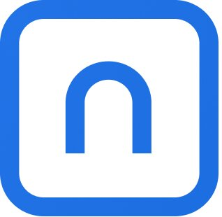 [Standard Notes](https://standardnotes.com/)

Unha das alternativas máis coñecidas. Pódese traballar de forma local, ou crear unha conta de balde e gardar as notas encriptadas extremos a extremo no seu servidor, de forma que poidamos acceder a elas dende outros dispositivos. Ten un plan de pagos que inclúe unha serie de funcións extras.

#####  [NotesNook](https://notesnook.com/)

Aínda que quizais menos coñecida ca a anterior, é unha alternativa moi potente. As notas tamén están encriptadas extremos a extremo, e o plan de balde inclúe algunha función máis ca no caso anterior. Coma sempre, é cuestión de probar e ver cal cumpre os nosos requisitos.

#####  [Joplin](https://joplinapp.org/)

Esta é outra das opción máis destacadas. A diferencia das anteriores, non permite a sincronización na nube de balde, para o que habería que subscribirse ou ben auto aloxala nun servidor.

### Mapas

#####  [OpenStreetMap](https://www.openstreetmap.org/)

É unha iniciativa para crear e proporcionar información xeográfica de forma libre, e non solo mapas das rúas. Para ser empregados dende o móbil é máis doado se empregamos unha das múltiples aplicacións que o usa como fonte de información xeográfica.

#####  [OsmAnd](https://osmand.net/)

Probablemente a aplicación máis potente para empregar o OpenStreetMap no noso dispositivo móbil. Dispón dun montón de ferramentas, como descargar os mapas para consultalos sen internet, navegador para o coche, seguimento de rutas, editor do propio OpenStreetMap e moitas máis.

#####  [CoMaps](https://www.comaps.app/)

Aínda que con menos opcións ca o OsmAnd, é outra alternativa moi recomendable para empregar o OpenStreetMap no noso móbil de forma máis sinxela. É un fork do OrganicMaps xestionado pola comunidade, [e que xurdiu por problemas de gobernanza.](https://news.itsfoss.com/organic-maps-fork-comaps/)

#####  [uMap](https://umap-project.org/)

En ocasións pode que precisemos compartir un mapa con puntos sinalados ou formas debuxadas. Aquí é onde entran ferramentas como uMap. Para empregala, pódese instalar nun servidor ou empregar instancias como [umap.openstreetmap.fr](https://umap.openstreetmap.fr/) ou [framacarte.org](https://framacarte.org).

### Navegador web

#####  [Firefox](https://www.mozilla.org/gl/firefox/)

É un dos navegadores máis potentes e coñecidos, e é libre, sendo xestionado pola Fundación Mozilla. A diferenza doutras opcións non libres, destaca por un menor consumo de recursos, ademais do respecto da privacidade das persoas usuarias.

#####  [TOR](https://www.torproject.org/
)

Se queres ir un paso máis alá, a rede Tor proporciona un paso extra de privacidade desviando a tua conexión por múltiples puntos, o que dificulta máis o seguimento das túas buscas. No capítulo [VPN, proxys e rede Tor. Que diferenzas hai e cando empregalas.](vpn_proxy_tor.md#cap:VPN_proxy_TOR) explicamos en máis detalle o funcionamento da rede TOR.

### Buscador web

##### 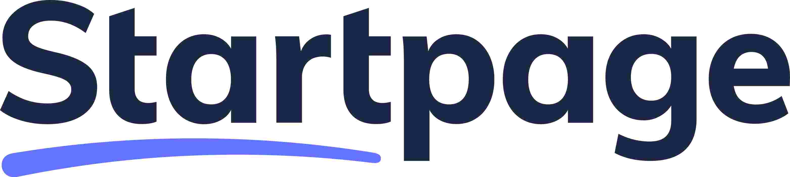 [Startpage](https://www.startpage.com/)

Unha das máis coñecidas e empregadas. A súa sede está nos Países Baixos, estando sometida á normativa europea de protección de datos. Os resultados obtidos baséanse principalmente no buscador de Google. Si, isto pode soar raro tendo en conta que estamos a falar de ferramentas alternativas a Google. Sen embargo, Startpage asegura non almacenar información persoal coma a dirección IP ou historial de busca.

#####  [SearX](https://github.com/searx/searx?tab=readme-ov-file)

Outra opción é a de Searx, un metabuscador descentralizado. A diferenza dos anteriores, non consiste nun buscador en si, se non que recolle as buscas obtidas por múltiples buscadores coma DuckDuckGo, Google, Bing, Startpage... Isto fai máis complexo facer un seguimento da persoa usuaria. Como punto negativo está que en ocasións algún dos buscadores que empregan bloquéano temporalmente. Para probalo podes probar unhas das [múltiples instancias dispoñibles](https://searx.space/).

### Almacenamento na nube

##### 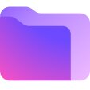 [Proton Drive](https://proton.me/drive)

Outro dos servizos do conxunto Proton é Proton Drive, que permite almacenar arquivos na nube de forma segura, estando estes encriptados de extremos a extremo. No plan de balde contamos con 5 GB, ampliable a través de plans de pago. A sua sede e os servidores atópanse en Suíza. A súa seguridade está auditada externamente, o que quere dicir que unha empresa ou entidade externa a Proton analizou a seguridade dos seus servidores.

#####  [Filen.io](https://filen.io/)

O plan gratuíto ofrece 10 GB de almacenamento encriptado extremo a extremo. Os servidores e a súa sede están en Alemaña. É multiplataforma, tendo versión do cliente para GNU/Linux, Android, iOS, Mac e Windows, ademais de cliente web. Non está auditada externamente.

#####  [Internxt Drive](https://internxt.com/es/drive)

Internxt é unha plataforma de almacenamento na nube centrada na privacidade, con cifrado extremo a extremo. O plan gratuíto ofrece 1 GB de almacenamento para sempre, con plans de pago dispoñibles de ata 10 TB. A seguridade está auditada externamente. Os arquivos cifrados almacénanse na UE: Francia, Alemaña e Polonia. A empresa ten a súa sede en España.

#####  [Internxt Send](https://send.internxt.com)

A veces so precisamos a nube para enviarlle a alguén de forma remota un arquivo de gran tamaño. Para estes casos, a xente de Internxt ten este servizo que, no plan de balde, nos permite enviar arquivos de ata 5 GB, que están dispoñibles para descarga durante 15 días, sendo eliminados pasado ese tempo. Hai que ter en conta que neste caso calquera persoa coa ligazón podería ver os arquivos, polo que se é información privada recoméndase empregar os outros servizos comentados nesta sección, ou protexelos de forma local con contrasinal.

#####  [OnionShare](https://onionshare.org)

OnionShare é unha ferramenta que che permite compartir arquivos de forma segura a través da rede TOR, entre outras funcións. Neste caso, tanto a persoa que envía o arquivo como a que o recibe deben instalar a aplicación.

#####  [Cryptomator](https://cryptomator.org)

Cryptomator é unha alternativa intermedia. Non ofrece como un espazo de almacenamento, se non que permite empregar servizos de almacenamento n nube non privados coma Google Drive encriptando os datos de forma sinxela antes de subilos. É multiplataforma e de balde, salvo a versión de Android dispoñible nas tendas de aplicación, que require un pago único para poder empregala.

### Xestor de contrasinais

#####  [Bitwarden](https://bitwarden.com/)

É un dos xestores de contrasinais máis coñecidos e seguros. É multiplataforma, podendo empregalo tanto no ordenador como en dispositivos móbiles,consta de función de almacenamento de contrasinais (as cales se almacenan de forma encriptada), de xeración automática de contrasinais seguras, e de envío de texto de forma encriptada. Moitas veces tendemos a empregar contrasinais sinxelas, repetíndoas en múltiples sitios web, o que diminúe a nosa seguridade na rede. O emprego de xestores coma Bitwarden mellora a nosa seguridade, como explicamos en detalle no capítulo [Contrasinais seguras e autenticación en dous pasos](contrasinais.md#contrasinais-2fa).

#####  [Proton Pass](https://proton.me/pass)

Ferramenta pertencente ao conxunto de ferramentas de Proton. Ten función semellantes ás de BitWarden.

### Autenticación en dous pasos (2FA)

#####  [FreeOTP](https://freeotp.github.io/)

A autenticación en dous pasos está moi relacionado co uso dos xestores de contrasinais, Non hai contrasinais 100% seguras, polo que é interesante aumentar as capas de protección, e aquí é onde entra o da autenticación en dous pasos. Isto non é máis ca un código de seis díxitos que temos que introducir para iniciar sesión tras introducir correctamente a nosa contrasinal. Este é un código temporal que vai cambiando, e aquí é onde resulta útil o emprego de ferramentas como FreeOTP, que nos permiten almacenar estes códigos de forma sinxela.

### Organización do fogar

#####  [KitchenOwl](https://kitchenowl.org/)

Aplicación multiplataforma cunha serie de funcionalidades útiles para persoas que comparten fogar, como a lista da compra ou o rexistrador de gastos compartidos.

### Reprodución multimedia

##### 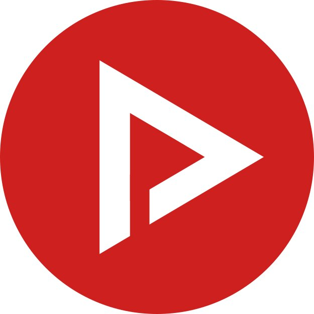 [NewPipe](https://newpipe.net/)

NewPipe é un cliente móbil para ver vídeos de YouTube dende o teu móbil sen precisar os servizo de Google e librándote de toda a telemetría. Ademais, a diferenza doutras alternativas, ten a vantaxe de que non funciona coa API de YouTube, [se non que fai web scrapping da web](https://newpipe.net/FAQ/#download-youtube-api), o que che permite obter un anonimato real. Tamén permite ver os comentarios, seguir canles e descargar vídeos e/ou audios.

#####  [AntennaPod](https://antennapod.org/)

AntennaPod é un cliente móbil para escoitar podcasts. Ten opcións para buscar directamente podcast dentro da aplicación, descargar episodios e recibir avisos cando se publique un novo podcast, entre outras.

#####  [VLC](https://www.videolan.org/vlc/)

Reprodutor de todo tipo de formatos de vídeo e audios.

### Edición multimedia

#####  [GIMP (GNU Image Manipulation Program)](https://www.gimp.org/)

GIMP (acrónimo de GNU Image Manipulation Program) é un programa de escritorio para a edición de imaxes en formato mapa de bits, coma por exemplo fotografías. Conten todo tipo de ferramentas. [Hai dispoñible un amplo conxunto de titoriais](https://docs.gimp.org/es/).

#####  [InkScape](https://inkscape.org/es/)

Inkscape é unha ferramenta de escritorio de debuxo multiplataforma de código aberto para gráficos vectoriais SVG. As características de SVG soportadas inclúen formas básicas, camiños, texto, canle alfa, transformacións, gradientes, edición de nodos, exportación de SVG a jpg, agrupación de elementos etc. [Hai dispoñible un conxunto de titoriais.](https://inkscape.org/es/aprende/tutorials/)

#####  [KDEnlive](https://kdenlive.org)

KDEnlive é un software de escritorio de edición de vídeo. Ofrece unha ampla variedade de ferramentas para cortar, mesturar e aplicar efectos aos vídeos, ademais de soportar varios formatos de ficheiros. [Hai dispoñible un conxunto de titoriais.](https://docs.kdenlive.org/es/getting_started/tutorials.html)

### Escaneamento de documentos

#####  [OSS Document Scanner](https://github.com/Akylas/OSS-DocumentScanner)

Ferramenta útil para escanear documentos co móbil e exportalos a PDF. Tamén permite converter a PDF imaxes que temos no propio móbil, recortalas, aplicar filtros para destacar o texto e moitas máis.

### Necesitas unha alternativa para outro servizo?

#####  [PrivacyTools.io](https://www.privacytools.io/)

Amplo catálogo de ferramentas que respectan a privacidade das persoas usuarias para distintos tipos de servizo. Nós na guía incluímos aquelas coas que tiñamos experiencia e que nos pareceron especialmente útiles, pero na súa páxina poderedes atopar moitas máis.

#####  [AlternativeTo.net](https://alternativeto.net/)

Páxina útil onde se pode introducir o nome da aplicación e atopar distintas alternativas. Hai que ter en conta que non todas as alternativas que mostra son libres. Para ver so as libres, hai que marcar a etiqueta Open Source.

#####  [Desgooglicemos Internet](https://degooglisons-internet.org/gl/)

Sección de Framasoft que contén alternativas libres a servizos de Google.

##### 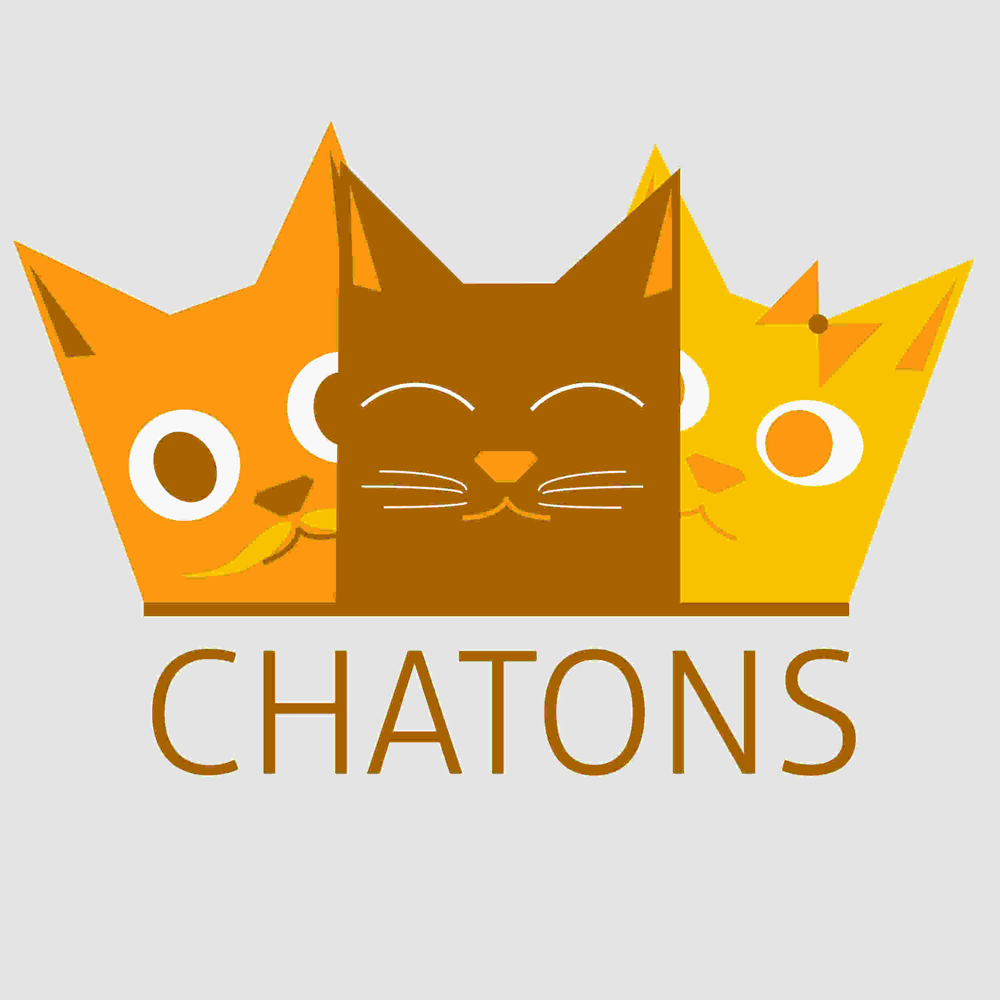 [CHATONS](https://www.chatons.org)

CHATONS é o Colectivo de Hosters Alternativo, Transparente, Aberto, Neutral e Solidario (CHATONS son as siglas en inglés). Este colectivo busca dar a coñecer estruturas que ofrecen servizos en liñas de balde, éticos e descentralizados para que sexa máis doado atopar alternativas a servizos ofrecidos pola GAFAM (Google, Apple, Facebook, Amazon, Microsoft) que respecten a súa privacidade. CHATONS foi iniciado polo colectivo Framasoft en 2016 tras a campaña Desgooglicemos Internet. Teñen [esta outra páxina](https://entraide.chatons.org) con alternativas aos principais servizos. Débese ser consciente de que uso lle damos ás ferramentas que aparecen, xa que en moitos casos a información non está encriptada extremo a extremo.
