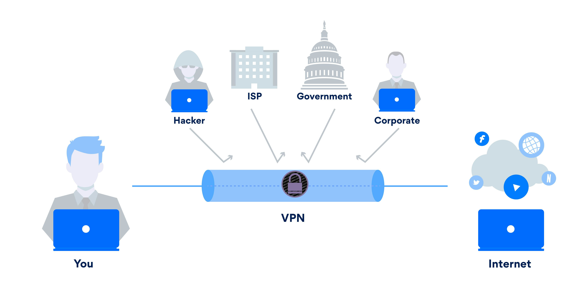

# VPN, proxys e rede Tor. Que diferenzas hai e cando empregalas.

No contexto da seguridade e privacidade en liña, o uso de ferramentas como VPNs, proxys e a rede Tor xoga un papel fundamental para protexer os nosos datos e a nosa identidade. Estas tecnoloxías permiten ocultar a nosa dirección IP, cifrar o tráfico de navegación e acceder a contidos restrinxidos, ofrecendo diferentes niveis de anonimato e seguridade. Neste capítulo, analizaremos o funcionamento de cada unha destas ferramentas, as súas vantaxes e limitacións, así como os escenarios nos que é recomendable empregar cada unha para reforzar a nosa protección na rede.

## Conceptos previos

Antes de explicar que é unha VPN, un proxy, a rede TOR e cales son as súas diferenzas, imos explicar unha serie de conceptos:

- **Dirección IP**: A dirección IP (Internet Protocol) é un identificador único que recibe un dispositivo cando se conecta a Internet, semellante a unha dirección postal pero no mundo dixital. Serve para que os datos poidan chegar ao destino correcto, permitindo que os dispositivos se comuniquen entre si. Existen dous tipos principais: as IP públicas, que identifican a conexión a Internet dunha rede, e as IP privadas, que identifican dispositivos dentro dunha rede local, como a de casa. Así, a dirección IP permite rastrexar a túa actividade en liña e a túa localización aproximada, polo que protexela é importante para a túa privacidade.

- **Cifrado dos datos**: O cifrado de datos é un proceso que converte a información orixinal nun formato inintelixible para que só poida ser lida por aquelas persoas ou sistemas que teñan a clave para descifralo. Funciona como un cadeado dixital: a información é protexida mediante algoritmos matemáticos que a transforman nunha cadea de caracteres aparentemente aleatoria.

  Por exemplo, se envías unha mensaxe cifrada, aínda que alguén a intercepte, non poderá entendela sen a clave correcta para descifrala. Este proceso é fundamental para protexer a información cando se transmite por Internet (como correos electrónicos ou compras en liña) ou cando se almacena nun dispositivo, garantindo que sexa segura e privada.

- **Servidor**: Un servidor é un ordenador ou sistema informático deseñado para xestionar, almacenar e fornecer datos, servizos ou recursos a outros ordenadores ou dispositivos chamados clientes. Pódese entender como un centro de control que proporciona o que os clientes solicitan, xa sexan páxinas web, ficheiros, correos electrónicos ou outro tipo de información. Por exemplo: Cando visitas un sitio web, o teu navegador (cliente) fai unha solicitude ao servidor onde está almacenada a páxina, e este responde enviándoche o contido para que poidas visualizalo. Se usas unha aplicación de correo, esta conéctase ao servidor de correo para enviar ou recibir mensaxes.

- **Rastrexo en liña**: O rastrexo en liña é o proceso mediante o cal as empresas, sitios web ou plataformas recompilan e almacenan información sobre as actividades que realizas mentres navegas por Internet. Este seguimento realízase utilizando diferentes ferramentas e tecnoloxías, como cookies, píxeles de seguimento ou scripts de rastrexo, que rexistran datos sobre as túas preferencias, hábitos de navegación e incluso a túa localización.

  Por exemplo, cando visitas unha tenda en liña, é posible que garden información sobre os produtos que consultaches ou engadiches ao carro. Máis tarde, podes ver anuncios deses mesmos produtos noutros sitios web. Isto é un exemplo de como funciona o rastrexo en liña.

  Os datos que se poden recompilar inclúen:

  - As páxinas web que visitas.

  - O tempo que pasas en cada sitio.

  - As buscas que fas.

  - O teu enderezo IP, que pode indicar a túa localización.

  - A información sobre o dispositivo e navegador que usas.

  O rastrexo en liña pode ter diferentes fins:

  - Publicidade personalizada: Mostrar anuncios relevantes segundo os teus intereses.

  - Análise de datos: Mellorar servizos e comprender mellor o comportamento das usuarias.

  - Segmentación de usuarias: Crear perfís detallados para ofrecer contido ou ofertas específicas.

- **Provedor de Servizo de Internet (ISP)**: Un ISP (Provedor de Servizo de Internet, polas súas siglas en inglés Internet Service Provider) é unha empresa ou entidade que proporciona ás usuarias acceso a Internet. Básicamente, o ISP é a porta que conecta a túa rede doméstica ou dispositivo á rede global de Internet. Funcións principais dun ISP:

  - Acceso a Internet: O ISP ofrece conexións a Internet a través de diferentes tecnoloxías, como DSL (liñas de subscrición dixitais), cable, fibra óptica, conexións satelitais ou conexións móbiles.

  - Dirección IP: O ISP asigna unha dirección IP (un identificador único na rede) ao dispositivo da usuaria. Esta dirección IP pode ser estática (sempre a mesma) ou dinámica (pode cambiar con cada conexión).

  - Servizos adicionais: Ademais do acceso a Internet, os ISP tamén poden ofrecer servizos complementarios como correo electrónico, aloxamento web, VPN, ou mesmo acceso a televisión por cable ou servizos de telefonía.

  **Como funciona un ISP?**

  Cando unha persoa ou empresa quere acceder a Internet, contrata un ISP que lle ofrece unha conexión adecuada para as súas necesidades. O ISP fornece a infraestrutura e os servidores necesarios para enrutar as solicitudes de conexión a través de diferentes redes até chegar ao destino na web. A súa función tamén inclúe manter a infraestrutura que permite a conexión, como routers, servidores DNS (para traducir os nomes de dominio en direccións IP), e outros equipos que aseguran o bo funcionamento da conexión.

  **Rastrexo a través do ISP:**

  É importante notar que, cando navegas por Internet, o teu ISP pode ver o tráfico que envías e recibes, incluíndo os sitios web que visitas. Polo tanto, o ISP pode rastrear e rexistrar a túa actividade en liña.

- **Redes públicas e privadas** É moi importante diferencias entre redes públicas e privadas, xa que aínda que o control da privacidade é importante en ambos casos, no caso das redes públicas é clave:

  - **Rede pública**: Unha rede pública é unha conexión de rede que está dispoñible para calquera persoa e, xeralmente, non require permisos específicos para acceder a ela. Exemplos típicos son redes Wi-Fi gratuítas en cafeterías, aeroportos, bibliotecas ou hoteis.

  - **Rede privada**: Unha rede privada é unha rede restrinxida á que só poden acceder usuarias autorizados. Estas redes adoitan ser usadas en fogares, empresas ou institucións para ofrecer conexión segura e controlada aos dispositivos conectados.

- **Navegación pública vs navegación privada**

  A **navegación privada** é unha funcionalidade que ofrecen a maioría dos navegadores web para que as usuarias poidan navegar sen que se gardaran certas informacións no dispositivo, como o historial de navegación, as cookies ou os datos das formularios. Características principais:

  - Non se gardan datos locais: O navegador non almacena o historial de navegación, as cookies ou os datos de sesión. Ao pechar a xanela de navegación privada, bórrase todo.

  - Útil para sesións temporais: É útil se non queres deixar rastro da túa actividade no dispositivo, por exemplo, cando usas un computador público ou compartido.

  - Non protexe contra rastreadores en liña: A pesar de que non se gardan os datos no dispositivo, a navegación privada non oculta a túa identidade ou actividade en liña dos sitios web. ou dos provedores de servizo de Internet (ISP)

  Esta navegación privada ten unha serie de limitacións:

  - Non evita que os sitios web rastrexen a túa actividade mediante a dirección IP ou mediante outros mecanismos de rastreo como as pegadas dixitais do navegador.

  - Non che proporciona anonimato ou protección contra espiar os teus datos.

  A **navegación anónima**, por outra banda, refírese a técnicas ou ferramentas que ocultan a túa identidade ou información persoal mentres navegas na web. O obxectivo principal é mellorar a privacidade, facendo que sexa máis difícil rastrexar as túas actividades en liña. Para isto empréganse as VPNs ou as redes TOR, que buscan engadir unha capa de protección extra, e que explicaremos en detalle máis abaixo. Hai que ter en conta que este tipo de navegación pode reducir a velocidade de navegación, xa que o tráfico ten que pasar por varios servidores antes de chegar ao seu destino. Ademais, por suposto, non é infalible, e as autoridades ou outras entidades poderían ser capaces de rastrexar a túa actividade con ferramentas avanzadas.

- **Punto de acceso**: Un punto de acceso é un dispositivo que permite aos dispositivos, como teléfonos, ordenadores ou tabletas, conectarse a a internet. É dicir, e a nosa porta de entrada ao resto da rede. Funciona como unha ponte entre os dispositivos e a rede principal, transmitindo e recibindo sinais.

## Que é unha VPN?

Unha **VPN** (Virtual Private Network, ou Rede Privada Virtual en galego) é unha tecnoloxía que permite crear unha conexión segura e cifrada entre un dispositivo (como un ordenador ou un teléfono móbil) e un servidor remoto a través de Internet. Este servidor actúa como un punto de acceso á rede, permitindo que os datos que se envían e reciben entre o dispositivo e a rede pública (Internet) viaxen de forma protexida e anónima.

A función principal dunha VPN é **garantir a privacidade e seguridade na navegación en liña**, cifrando a comunicación entre a usuaria e o servidor de Internet, e facendo que sexa moito máis difícil para terceiros, como cibercriminais ou provedores de servizos de Internet (ISPs), interceptar, espiar ou censurar esa información.

### Como funciona unha VPN?

- **Cifrado de datos:** A VPN utiliza protocolos de cifrado para encriptar os datos que viaxan entre o dispositivo da usuaria e o servidor da VPN. Isto significa que mesmo que alguén intentase interceptar os datos en tránsito, non podería lelos, xa que estarían codificados de maneira que só o servidor de destino ou o dispositivo de orixe poidan descifrala. Hai que ter en conta que non todos os servizos de VPN envían os datos de forma encriptada.

- **Túnel seguro:** A conexión establecida entre o dispositivo e o servidor da VPN chámase un túnel. Este túnel é privado e protexe os datos, facendo que non sexan accesibles a ninguén que intente espiar ou interromper a conexión. Isto impide que outras persoas na mesma rede (como nunha rede Wi-Fi pública) poidan acceder aos teus datos ou ao que estás facendo en liña.

- **Cambiar a dirección IP:** Unha das principais vantaxes dunha VPN é que pode ocultar a túa verdadeira **dirección IP**, que é un identificador único asociado ao teu dispositivo cando te conectas a Internet. Ao conectarte a un servidor VPN, a túa dirección IP real queda oculta e é substituída pola dirección IP do servidor VPN. Isto pode mellorar a túa privacidade en liña, facendo máis difícil para terceiros rastrearte ou determinar a túa localización real.

- **Acceso a contidos bloqueados:** Como a túa dirección IP se substitúe pola do servidor VPN, tamén pode permitirche acceder a contidos ou servizos bloqueados na túa rexión xeográfica. Por exemplo, se un sitio web ou servizo está dispoñible só en Estados Unidos, pero ti estás en Europa, unha VPN pode facerche parecer que estás en EE.UU. para acceder a ese contido.

- **Seguridade na navegación en redes públicas:** As VPNs son especialmente útiles cando se usan redes Wi-Fi públicas, como as que se atopan en cafés, aeroportos ou bibliotecas. Neste tipo de redes, a seguridade é moito máis feble e os cibercriminais poden tentar interceptar a comunicación. A VPN protexe os teus datos ao cifralos e asegurar que non sexan facilmente accesibles.

### Limitacións e desvantaxes dunha VPN

- **Velocidade:** Ao usar unha VPN, pode haber unha diminución da velocidade de navegación debido ao cifrado e ao paso dos datos polo servidor remoto. Isto pode ser un problema cando se realizan tarefas que requiren moito ancho de banda, como a transmisión de vídeo en alta definición.

- **Confiar no servidor VPN:** Ao utilizar unha VPN, estás confiando no servidor da VPN para protexer a túa privacidade. Se o servidor VPN non está ben protexido ou se o provedor de VPN mantén rexistros de actividade, a privacidade da usuaria pode verse comprometida.

- **Accesibilidade a servizos:** Algúns servizos, como plataformas de transmisión de vídeo ou sitios web, poden bloquear as conexións VPN para evitar que as usuarias accedan a contidos restrinxidos por rexión.

En resumo, unha **VPN** é unha ferramenta útil para mellorar a seguridade e a privacidade en liña, cifrando a comunicación e ocultando a túa dirección IP, pero tamén presenta algunhas limitacións que deben terse en conta ao utilizala.

### Que VPN usar?

Existen múltples opcións de ferramentas VPN. Nesta guía ímonos centrar en [Proton VPN](https://protonvpn.com/) e [Mullvad](https://mullvad.net/en/vpn), dúas das máis coñecidas e con mellor reputación:

-  [ProtonVPN](https://protonvpn.com/): É a VPN do ecosistema VPN, con sede en Suíza. Ten unha versión de balde que conten as principais funcións que se precisas para un uso básico. Entre os diferentes protocolos que permite empregar (automáticamente decide cal usar en cada situación), atópase o protocolo [stealth](https://protonvpn.com/blog/stealth-vpn-protocol), especialmente útil para conectarte a internet en espazos onde o emprego de VPN está bloqueado. Este protocolo está dispoñible en todas as plataformas salvo en GNU/Linux, asi que se empregas GNU/Linux e te atopas nun entorno no que a VPN de Proton está bloqueada, precisarás empregar a VPN que se indica a continuación.

-  [Mullvad VPN](https://mullvad.net/en/vpn): Outras das VPN máis destacadas en canto a privacidade. A súa sede está en Suecia, inda que podes conectarte a servidores de páises de todo o mundo. A diferenza do caso de ProtonVPN, só ten plan de pago (5€/mes). Conta con múltiples protocolos de comunicación, o que fan que funcione incluso en entornos onde o emprego de VPN está bloqueado. [Nesta ligazón](https://mullvad.net/en/help/connecting-to-mullvad-vpn-from-restrictive-locations) podedes ver máis información sobre o emprego de Mullvad neste tipo de entornos

No caso de que saibas con antelación que vas estar nun entorno onde as VPN están bloqueadas, é recomendable que configures previamente a VPN nos teus dispositivos. Ademais, é boa práctica ter dúas VPN, para ter unha segunda opción no caso de que falle a primeira.

## Que é un Proxy?

Un **proxy** é un servidor que actúa como intermediario entre un cliente, como un ordenador ou un dispositivo móbil, e un servidor ao que se quere acceder a través de Internet. En outras palabras, cando unha usuaria fai unha solicitude para acceder a un sitio web ou servizo en liña, o proxy reenvía esta solicitude en nome da usuaria, recolle a resposta do servidor e logo envía a información de volta á usuaria.

Este proceso ten varias funcións e beneficios, tales como:

- **Privacidade e anonimato:** O proxy oculta a dirección IP da usuaria, facendo que as solicitudes á Internet parezan vir do propio proxy e non do dispositivo da usuaria. Isto pode ser útil para mellorar a privacidade na navegación e para evitar que se rastrexen as actividades da usuaria en liña.

- **Control de acceso:** O proxy pode bloquear o acceso a sitios web específicos ou filtrar o contido baseado en políticas de acceso, como as que se implementan en redes corporativas ou en escolas.

- **Mellora do rendemento:** Un proxy pode almacenar en caché (ou gardar localmente) as páxinas ou recursos web máis solicitados. Isto significa que cando outra usuaria fai a mesma solicitude, o proxy pode entregar o contido directamente desde a súa caché, mellorando a velocidade de acceso e reducindo o uso de ancho de banda.

- **Seguridade adicional:** Ao actuar como intermediario, un proxy pode ofrecer certas medidas de seguridade, como a detección de sitios maliciosos, a análise de tráfico para atopar posibles ameazas e a protección contra certos tipos de ataques.

Porén, aínda que os proxies ofrecen certos beneficios, **tamén teñen limitacións importantes en comparación con outras tecnoloxías como as redes privadas virtuais (VPNs)**. A principal diferenza é que un proxy non cifra a conexión entre a usuaria e o servidor. Isto significa que, a diferenza dunha VPN, a comunicación a través dun proxy non está protexida contra a escoita por terceiros, polo que non ofrece a mesma seguridade en conexións sen cifrar.

En resumo, un proxy é útil para mellorar a privacidade, controlar o acceso a sitios web e mellorar o rendemento, pero non proporciona o nivel de seguridade e privacidade que se pode obter cunha VPN.

## Que é a Rede TOR?

A [**rede TOR** (The Onion Router)](https://www.torproject.org/) é unha rede descentralizada de servidores que permite a navegación anónima en Internet. O seu principal obxectivo é proporcionar ás usuarias a capacidade de navegar sen que a súa identidade ou actividade sexan rastrexadas. O funcionamento de TOR baséase no uso de múltiples capas de cifrado, que actúan como lóbulos dunha cebola, de aí o nome onion routing, encamiñado de cebola.

### Proceso de cifrado

Cando unha usuaria envía datos a través de TOR, estes son cifrados en múltiples capas, de forma semellante ás capas dunha cebola. Cada nodo da rede TOR só pode descifrar unha das capas, garantindo que ningún nodo intermedio teña acceso ao contido completo da comunicación nin á súa orixe e destino final ao mesmo tempo. O **proceso de cifrado** funciona así:

- A usuaria TOR escolle un camiño aleatorio de nodos da rede (por defecto son tres nodos, aínda que se pode incrementar o número).

- O tráfico é cifrado usando un **cifrado en capas**, aplicando unha capa de cifrado para cada nodo polo que pasará o tráfico.

- O primeiro nodo da ruta (nodo de entrada) descifra a primeira capa, pero só sabe quen é o usuario e o seguinte nodo da ruta.

- O segundo nodo elimina a súa capa de cifrado, pero só sabe de onde veu a mensaxe (o primeiro nodo) e a quen debe enviala (o terceiro nodo).

- O terceiro nodo (nodo de saída) elimina a última capa de cifrado e envía o tráfico ao seu destino final na internet.

Este proceso de encamiñado múltiple e cifrado en cada paso fai que, ao final, a orixe da solicitude se volva irrecoñecible para o servidor de destino, xa que o tráfico é cifrado en múltiples capas e enviado a través de varios puntos na rede antes de chegar ao seu destino. Ademais, hai algúns servizos que se atopan directamente dentro da rede TOR, os dominios rematados en .onion, de forma que en ningún momento é preciso saír da rede TOR.

### Vantaxes da rede TOR

As principais **vantaxes da rede TOR** son as seguintes:

- **Anonimato:** Ao pasar a través de varios nodos, a dirección IP da usuaria queda oculta, facendo imposible rastrexar a súa localización ou a súa identidade a través da súa conexión á rede. Isto fai que TOR sexa popular entre as usuarias que desexan manter o seu anonimato en liña.

- **Evasión de censura:** TOR permite ás usuarias acceder a sitios web e servizos bloqueados ou censurados nalgúns países ou redes, xa que oculta a súa identidade e orixe. Isto é especialmente útil para xornalistas, activistas e usuarias que operan en países con altas restricións de acceso á información.

- **Seguridade mellorada:** A comunicación a través da rede TOR está cifrada en varias capas, o que proporciona unha protección adicional contra escoitas e ataques. Isto é útil especialmente cando se accede a sitios web sensibles ou se intercambian datos confidenciais.

### Desvantaxes da rede TOR

Sen embargo, a rede TOR tamén presenta certas desvantaxes (hai que lembrar que a seguridade ao 100% non existe):

- **Velocidade de conexión**: A principal delas é que, debido ao encamiñar en múltiples capas e nodos, a velocidade de navegación pode ser considerablemente máis lenta en comparación con outras formas de navegación en Internet.

- **Vulnerabilidade ao saír da rede TOR**: TOR non garante a seguridade total, xa que os nodos de saída da rede poden ser vulnerables a ataques, e o tráfico encriptado só se mantén seguro entre os nodos da rede, pero non no nodo de saída, onde se descifra e pode ser escoitado por partes mal intencionadas. Sen embargo, neste caso, aínda que poderían saber a que recurso se está accedendo, non poderían saber quen está accedendo, xa que pasou a través de varios nodos TOR. No caso de acceder a **dominios .onion**, non se chega a saír da rede TOR, polo que xa non existe tal vulnerabilidade.

- **Nodos maliciosos**: Outra vulnerabilidade é que unha atacante con control de múltiples nodos podería intentar relacionar o tráfico de entrada e saída, aínda que tería que cadrar que xusto a ruta pase a través dos nodos dunha mesma atacante.

En resumo, a rede TOR é unha ferramenta poderosa para manter o anonimato e a privacidade en liña, pero tamén ten limitacións en termos de velocidade e seguridade no nodo de saída. A súa utilización é recomendada para aquelas usuarias que desexan acceder a Internet de forma anónima ou eludir a censura en liña. Para poder empregala, debes descargar o navegador dende a súa [páxina oficial](https://www.torproject.org/).

## Comparativa entre VPN, Proxy e rede TOR

| **Característica**    | **VPN**                                           | **Proxy**                                                            | **Rede TOR**                                                                     |
|:----------------------|:--------------------------------------------------|:---------------------------------------------------------------------|:---------------------------------------------------------------------------------|
| **Anonimato**         | Alto: Oculta a IP e cifrado completo              | Medio: Oculta a IP, pero non cifra todo o tráfico                    | Alto: Oculta a IP e cifra todo o tráfico                                         |
| **Seguridade**        | Alto: Cifrado de todo o tráfico                   | Baixo: Só oculta a IP, sen cifrado                                   | Alto: Cifrado de múltiples capas e anonimato                                     |
| **Rendemento**        | Medio: Lixeiramente máis lento debido ao cifrado  | Rápido: Sen cifrado, pero pode ser máis lento dependendo do servidor | Lento: Debido ao roteo de múltiples nodos                                        |
| **Accesibilidade**    | Accede a calquera sitio                           | Accede a sitios específicos a través do servidor proxy               | Accede a sitios censurados ou bloqueados                                         |
| **Censura**           | Elude a censura, pero depende do provedor         | Elude a censura, pero só se está configurado correctamente           | Elude a censura de forma eficaz, ocultando a orixe do tráfico                    |
| **Facilidade de uso** | Relativamente sinxelo de configurar               | Sinxelo de configurar, pero con limitacións                          | Require software especializado (Tor Browser)                                     |
| **Privacidade**       | Alta, pero depende do provedor de VPN             | Baixa: o servidor pode rexistrar a actividade                        | Alta, xa que non hai un único punto de fallos que rexistre a actividade          |
| **Compatibilidade**   | Funciona con calquera aplicación que use Internet | Funciona principalmente para HTTP/HTTPS, é dicir, navegadores.       | Funciona principalmente co [navegador Tor](https://www.torproject.org/download/) |
| **Ferramenta libre**  | [Proton VPN](https://protonvpn.com/)              | \-                                                                   | [Navegador Tor](https://www.torproject.org/download/)                            |

Comparativa entre VPN, Proxy e Rede TOR
